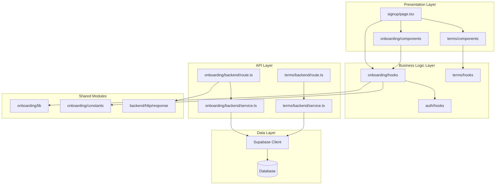

# 역할 선택 & 온보딩 기능 모듈화 설계

## 개요

### 기능별 모듈 구성

| 모듈 | 위치 | 설명 |
|-----|------|------|
| **onboarding feature** | `src/features/onboarding` | 회원가입 및 온보딩 전체 기능 |
| **onboarding/backend** | `src/features/onboarding/backend` | 회원가입 API 엔드포인트 및 비즈니스 로직 |
| **onboarding/components** | `src/features/onboarding/components` | 회원가입 UI 컴포넌트 |
| **onboarding/hooks** | `src/features/onboarding/hooks` | 회원가입 관련 React hooks |
| **onboarding/lib** | `src/features/onboarding/lib` | 유틸리티 함수 및 DTO |
| **onboarding/constants** | `src/features/onboarding/constants` | 상수 정의 (역할, 검증 규칙 등) |
| **terms feature** | `src/features/terms` | 약관 관리 기능 (재사용 가능) |
| **terms/backend** | `src/features/terms/backend` | 약관 조회 API |
| **terms/components** | `src/features/terms/components` | 약관 동의 UI 컴포넌트 |
| **auth extension** | `src/features/auth` | 기존 auth 기능 확장 |
| **signup page** | `src/app/signup` | 회원가입 페이지 (리팩토링) |
| **database migration** | `supabase/migrations` | terms_agreements 테이블 추가 |

## Diagram



## Implementation Plan

### 1. Database Migration
**위치**: `supabase/migrations/0002_add_terms_agreements.sql`

```sql
-- terms_agreements 테이블 생성
CREATE TABLE IF NOT EXISTS terms_agreements (
    id UUID PRIMARY KEY DEFAULT gen_random_uuid(),
    user_id UUID NOT NULL REFERENCES profiles(id) ON DELETE CASCADE,
    terms_version TEXT NOT NULL,
    terms_type TEXT NOT NULL CHECK (terms_type IN ('service', 'privacy')),
    agreed_at TIMESTAMPTZ NOT NULL DEFAULT NOW(),
    ip_address INET,
    user_agent TEXT,
    created_at TIMESTAMPTZ DEFAULT NOW()
);
```

### 2. Backend Layer

#### 2.1 Onboarding Backend
**위치**: `src/features/onboarding/backend/`

- **schema.ts**: 요청/응답 zod 스키마 정의
  ```typescript
  - SignupRequestSchema: email, password, role, name, phoneNumber, termsAgreed
  - SignupResponseSchema: userId, role, token
  - ProfileSchema: 프로필 정보 스키마
  ```

- **error.ts**: 에러 코드 정의
  ```typescript
  - EMAIL_ALREADY_EXISTS
  - INVALID_INPUT
  - PROFILE_CREATION_FAILED
  - TERMS_NOT_AGREED
  ```

- **service.ts**: 비즈니스 로직
  - 이메일 중복 확인
  - Supabase Auth 계정 생성
  - 프로필 생성
  - 약관 동의 이력 저장

- **route.ts**: API 엔드포인트
  - POST /api/onboarding/signup

**Unit Tests**:
- 이메일 중복 체크 로직 테스트
- 프로필 생성 성공/실패 테스트
- 약관 동의 검증 테스트
- 역할 검증 테스트

#### 2.2 Terms Backend
**위치**: `src/features/terms/backend/`

- **service.ts**: 약관 조회 로직
- **route.ts**: GET /api/terms/latest

### 3. Frontend Layer

#### 3.1 Onboarding Components
**위치**: `src/features/onboarding/components/`

- **SignupForm.tsx**: 회원가입 폼 컴포넌트
  - 이메일/비밀번호 입력
  - 역할 선택 (Radio Button)
  - 프로필 정보 입력
  - 폼 검증

- **RoleSelector.tsx**: 역할 선택 컴포넌트
  - Learner/Instructor 선택
  - 역할 설명 표시

- **ProfileForm.tsx**: 프로필 정보 입력 컴포넌트
  - 이름, 휴대폰번호 입력
  - 실시간 검증

**QA Sheet**:
- [ ] 이메일 형식 검증이 올바르게 동작하는가?
- [ ] 비밀번호 정책이 올바르게 적용되는가?
- [ ] 역할 선택이 필수인가?
- [ ] 프로필 필수 항목이 모두 입력되었는가?
- [ ] 약관 동의 없이 제출이 차단되는가?
- [ ] 중복 이메일 에러가 올바르게 표시되는가?
- [ ] 네트워크 오류 시 재시도가 가능한가?
- [ ] 성공 시 올바른 페이지로 리다이렉트되는가?

#### 3.2 Terms Components
**위치**: `src/features/terms/components/`

- **TermsAgreement.tsx**: 약관 동의 컴포넌트
  - 약관 내용 표시
  - 전체 동의 체크박스
  - 개별 약관 동의 체크박스
  - 필수/선택 구분

**QA Sheet**:
- [ ] 약관 내용이 올바르게 표시되는가?
- [ ] 필수 약관이 구분되어 표시되는가?
- [ ] 전체 동의가 올바르게 동작하는가?
- [ ] 필수 약관 미동의 시 경고가 표시되는가?

### 4. Hooks Layer

#### 4.1 Onboarding Hooks
**위치**: `src/features/onboarding/hooks/`

- **useSignup.ts**: 회원가입 mutation hook
  - React Query 사용
  - 에러 처리
  - 성공 시 처리

- **usePasswordValidation.ts**: 비밀번호 검증 hook
  - 실시간 검증
  - 정책 체크

#### 4.2 Terms Hooks
**위치**: `src/features/terms/hooks/`

- **useTerms.ts**: 약관 조회 hook
- **useTermsAgreement.ts**: 약관 동의 상태 관리

### 5. Constants & Utils

#### 5.1 Constants
**위치**: `src/features/onboarding/constants/`

- **roles.ts**: 역할 상수 정의
  ```typescript
  export const USER_ROLES = {
    LEARNER: 'learner',
    INSTRUCTOR: 'instructor'
  } as const;
  ```

- **validation.ts**: 검증 규칙 정의
  ```typescript
  export const PASSWORD_RULES = {
    MIN_LENGTH: 8,
    REQUIRE_SPECIAL: true,
    // ...
  };
  ```

#### 5.2 Utils
**위치**: `src/features/onboarding/lib/`

- **validation.ts**: 검증 유틸리티 함수
  - 이메일 검증
  - 비밀번호 검증
  - 휴대폰번호 검증

- **dto.ts**: 백엔드 스키마 재노출
  ```typescript
  export type { SignupRequest, SignupResponse } from '../backend/schema';
  ```

### 6. Page Integration
**위치**: `src/app/signup/page.tsx`

기존 페이지 리팩토링:
- onboarding feature의 컴포넌트 사용
- 역할 선택 추가
- 프로필 정보 입력 추가
- 약관 동의 추가
- 역할별 리다이렉트 로직 구현

### 7. Testing Strategy

#### Backend Unit Tests
- 각 service 함수별 단위 테스트
- 에러 케이스 테스트
- 데이터 검증 테스트

#### Frontend Component Tests
- 폼 검증 테스트
- 사용자 인터랙션 테스트
- 에러 표시 테스트

#### Integration Tests
- 전체 회원가입 플로우 테스트
- API 통신 테스트
- 리다이렉트 테스트

### 8. Security Considerations

- 비밀번호는 클라이언트에서 한 번, 서버에서 한 번 검증
- SQL Injection 방지를 위한 파라미터 바인딩
- XSS 방지를 위한 입력 값 sanitization
- CSRF 토큰 검증 (Supabase 내장)
- Rate limiting 적용 고려

### 9. Performance Optimization

- 약관 내용 캐싱
- 폼 입력 디바운싱
- 이미지 lazy loading
- API 요청 최적화