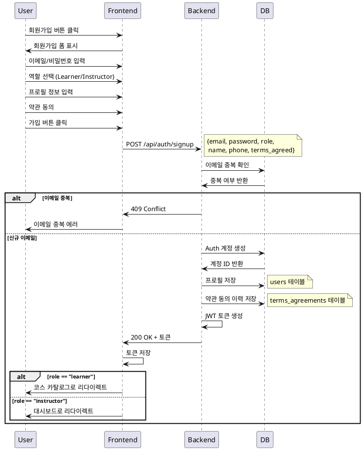

# 역할 선택 & 온보딩 상세 유스케이스

## Primary Actor
신규 사용자 (미가입자)

## Precondition
- 사용자가 서비스에 처음 접속한 상태
- 유효한 이메일 주소를 보유
- 인터넷 연결 가능

## Trigger
사용자가 회원가입 버튼을 클릭

## Main Scenario

1. 사용자가 회원가입 페이지에 진입
2. 이메일과 비밀번호 입력
3. 역할 선택 (Learner 또는 Instructor)
4. 공통 프로필 정보 입력 (이름, 휴대폰번호)
5. 서비스 이용약관 및 개인정보 처리방침 확인 후 동의
6. 회원가입 완료 버튼 클릭
7. 시스템이 입력 정보 검증
8. 계정 생성 및 프로필 저장
9. 인증 토큰 발급
10. 역할에 따른 초기 화면으로 리다이렉트
    - Learner: 코스 카탈로그
    - Instructor: 대시보드

## Edge Cases

### 이메일 중복
- 이미 등록된 이메일인 경우 에러 메시지 표시
- 로그인 페이지로 유도

### 입력 검증 실패
- 이메일 형식 오류: 올바른 형식 안내
- 비밀번호 정책 미충족: 최소 요구사항 표시 (예: 8자 이상, 특수문자 포함)
- 휴대폰번호 형식 오류: 정확한 형식 안내

### 네트워크 오류
- 요청 실패 시 재시도 버튼 표시
- 일시적 오류 메시지 노출

### 약관 미동의
- 필수 약관 동의 없이는 진행 불가
- 동의 필요 항목 강조 표시

## Business Rules

1. **이메일 유일성**: 하나의 이메일로 하나의 계정만 생성 가능
2. **역할 불변성**: 최초 선택한 역할은 변경 불가 (Learner ↔ Instructor 전환 불가)
3. **필수 정보**: 이름, 휴대폰번호, 약관 동의는 필수
4. **비밀번호 정책**: 최소 8자, 영문/숫자/특수문자 중 2종류 이상 조합
5. **약관 이력 관리**: 동의한 약관 버전과 일시를 기록
6. **초기 권한**: 기본 권한만 부여, 추가 권한은 별도 프로세스 필요

## Sequence Diagram

