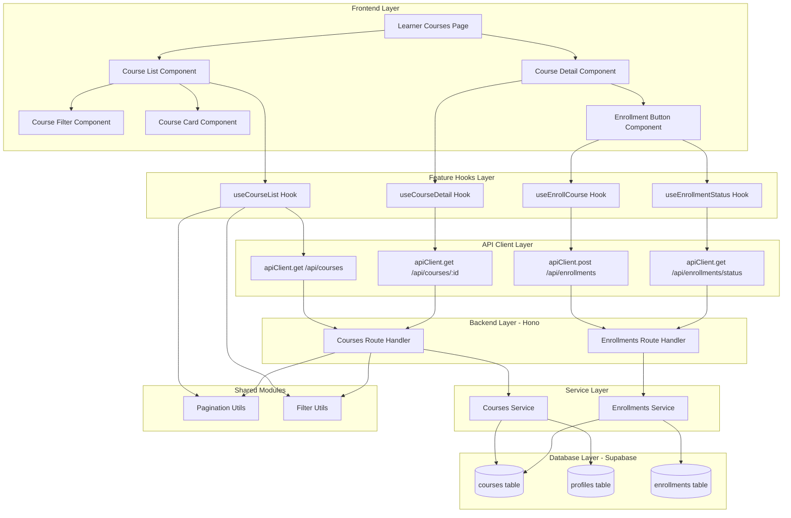

# 코스 탐색 & 수강신청 기능 구현 설계

## 개요

### 1. 코스 관리 모듈 (src/features/courses)
- **위치**: `src/features/courses`
- **설명**: 코스 목록 조회, 검색, 필터링, 정렬, 상세 정보 조회

### 2. 수강신청 모듈 (src/features/enrollments)
- **위치**: `src/features/enrollments`
- **설명**: 수강신청 처리, 중복 체크, 수강 상태 관리

### 3. 공통 페이지네이션 모듈 (src/lib/pagination)
- **위치**: `src/lib/pagination`
- **설명**: 재사용 가능한 페이지네이션 스키마 및 유틸리티

### 4. 공통 필터링 모듈 (src/lib/filters)
- **위치**: `src/lib/filters`
- **설명**: 검색, 카테고리, 난이도 필터링 공통 타입 및 유틸리티

### 5. 학습자 페이지 (src/app/(protected)/learner)
- **위치**: `src/app/(protected)/learner/courses`
- **설명**: 코스 카탈로그 및 상세 페이지 라우트

## Diagram



## Implementation Plan

### Phase 1: 공통 모듈 구현

#### 1.1 Pagination Module (`src/lib/pagination`)
```typescript
// pagination.schema.ts
- PaginationRequestSchema: { page, limit, sort, order }
- PaginationResponseSchema: { items, total, page, totalPages }

// pagination.utils.ts
- calculateOffset(page, limit)
- createPaginationResponse(items, total, page, limit)
```

**Unit Tests**:
- calculateOffset 정확성 테스트
- createPaginationResponse 응답 형식 검증

#### 1.2 Filter Module (`src/lib/filters`)
```typescript
// course-filters.ts
- CourseFiltersSchema: { search?, category?, difficulty?, status? }
- buildFilterQuery(filters, queryBuilder)
- sanitizeSearchTerm(term)
```

**Unit Tests**:
- buildFilterQuery SQL 조건 생성 검증
- sanitizeSearchTerm 특수문자 처리 테스트

### Phase 2: Courses Feature 구현

#### 2.1 Backend Layer (`src/features/courses/backend`)

**schema.ts**:
```typescript
- CourseListRequestSchema: extends PaginationRequestSchema & CourseFiltersSchema
- CourseResponseSchema: { id, title, description, instructor, category, difficulty, enrollmentCount }
- CourseDetailResponseSchema: extends CourseResponseSchema with curriculum
```

**error.ts**:
```typescript
- COURSE_NOT_FOUND
- COURSE_FETCH_ERROR
- INVALID_COURSE_PARAMS
```

**service.ts**:
- `getCourseList(supabase, filters, pagination)`: published 코스 목록 조회
- `getCourseById(supabase, courseId, userId?)`: 코스 상세 + 수강 상태 조회
- `getCourseEnrollmentCount(supabase, courseId)`: 수강생 수 집계

**route.ts**:
- `GET /api/courses`: 코스 목록 조회 엔드포인트
- `GET /api/courses/:id`: 코스 상세 조회 엔드포인트

**Unit Tests**:
- 필터별 코스 목록 조회 테스트
- published 상태 코스만 반환 검증
- 페이지네이션 동작 테스트

#### 2.2 Frontend Layer (`src/features/courses`)

**hooks/useCourseList.ts**:
- React Query 기반 코스 목록 조회
- 필터, 검색, 페이지네이션 파라미터 처리

**hooks/useCourseDetail.ts**:
- 코스 상세 정보 조회
- 수강 상태 포함

**components/CourseCard.tsx**:
- 코스 카드 UI (제목, 강사명, 카테고리, 난이도)
- 수강 상태 뱃지 표시

**components/CourseFilter.tsx**:
- 검색 입력 필드
- 카테고리/난이도 필터 드롭다운
- 정렬 옵션 (최신순/인기순)

**QA Sheet**:
- [ ] 검색어 입력 시 실시간 필터링 동작
- [ ] 필터 적용 시 URL 쿼리 파라미터 업데이트
- [ ] 빈 검색 결과 시 적절한 메시지 표시
- [ ] 로딩 상태 표시
- [ ] 에러 상태 처리

### Phase 3: Enrollments Feature 구현

#### 3.1 Backend Layer (`src/features/enrollments/backend`)

**schema.ts**:
```typescript
- EnrollmentRequestSchema: { courseId, userId }
- EnrollmentResponseSchema: { id, courseId, learnerId, enrolledAt }
- EnrollmentStatusSchema: { isEnrolled, enrollmentId? }
```

**error.ts**:
```typescript
- ALREADY_ENROLLED
- ENROLLMENT_FAILED
- COURSE_NOT_AVAILABLE
```

**service.ts**:
- `createEnrollment(supabase, courseId, learnerId)`: 수강신청 생성
- `checkEnrollmentStatus(supabase, courseId, learnerId)`: 수강 여부 확인
- `getEnrollmentsByCourse(supabase, courseId)`: 코스별 수강생 목록

**route.ts**:
- `POST /api/enrollments`: 수강신청 생성
- `GET /api/enrollments/status`: 수강 상태 확인

**Unit Tests**:
- 중복 수강신청 방지 테스트
- 삭제된/draft 코스 신청 차단 테스트
- 트랜잭션 롤백 테스트

#### 3.2 Frontend Layer (`src/features/enrollments`)

**hooks/useEnrollCourse.ts**:
- 수강신청 mutation
- 성공/실패 처리
- 캐시 무효화

**hooks/useEnrollmentStatus.ts**:
- 특정 코스 수강 상태 조회

**components/EnrollmentButton.tsx**:
- 수강신청/수강중 버튼 상태 전환
- 로딩 상태 표시
- 에러 토스트 표시

**QA Sheet**:
- [ ] 미로그인 시 로그인 페이지로 리다이렉트
- [ ] 수강신청 성공 시 버튼 상태 즉시 변경
- [ ] 중복 신청 시 적절한 에러 메시지
- [ ] 네트워크 오류 시 재시도 옵션 제공
- [ ] 버튼 연속 클릭 방지 (debounce)

### Phase 4: Page Implementation

#### 4.1 코스 목록 페이지 (`src/app/(protected)/learner/courses/page.tsx`)
- CourseList 컴포넌트 통합
- 필터 상태 관리
- URL 쿼리 파라미터 동기화

**QA Sheet**:
- [ ] 페이지 진입 시 코스 목록 자동 로드
- [ ] 필터 변경 시 URL 업데이트
- [ ] 브라우저 뒤로가기 시 필터 상태 복원
- [ ] 무한 스크롤 또는 페이지네이션 동작

#### 4.2 코스 상세 페이지 (`src/app/(protected)/learner/courses/[id]/page.tsx`)
- CourseDetail 컴포넌트 렌더링
- EnrollmentButton 통합
- 404 처리

**QA Sheet**:
- [ ] 존재하지 않는 코스 ID 접근 시 404 페이지
- [ ] draft 코스 접근 시 권한 없음 메시지
- [ ] 수강 상태에 따른 UI 분기
- [ ] 메타 태그 설정 (SEO)

### Phase 5: Integration Testing

**E2E Test Scenarios**:
1. 코스 목록 조회 → 필터링 → 상세 진입 → 수강신청
2. 이미 수강 중인 코스 재신청 시도
3. 검색 결과 없음 → 필터 초기화
4. 페이지네이션 네비게이션
5. 네트워크 오류 시뮬레이션 및 복구

### Phase 6: Database Migration

**Migration File**: `supabase/migrations/0003_add_course_indexes.sql`
```sql
-- 검색 성능 향상을 위한 인덱스 추가
CREATE INDEX idx_courses_title_gin ON courses USING gin(to_tsvector('english', title));
CREATE INDEX idx_courses_description_gin ON courses USING gin(to_tsvector('english', description));
CREATE INDEX idx_courses_category_difficulty ON courses(category, difficulty);
CREATE INDEX idx_enrollments_created_at ON enrollments(created_at DESC);
```

## 성공 지표

### Performance Metrics
- 코스 목록 로딩: < 500ms
- 검색 응답 시간: < 300ms
- 수강신청 처리: < 1s

### Quality Metrics
- 테스트 커버리지: > 80%
- TypeScript 타입 안정성: 100%
- 에러 처리율: 100%

## 리스크 및 대응 방안

### Risk 1: 대량 코스 데이터 처리
- **대응**: 페이지네이션 필수, 가상 스크롤 고려

### Risk 2: 동시 수강신청 경합
- **대응**: DB 레벨 unique constraint, 트랜잭션 처리

### Risk 3: 검색 성능 저하
- **대응**: Full-text search 인덱스, 디바운싱, 결과 캐싱

## 향후 개선 사항

1. **코스 추천 시스템**: 사용자 선호도 기반 추천
2. **고급 필터**: 가격, 기간, 평점 등 추가 필터
3. **코스 미리보기**: 일부 콘텐츠 무료 제공
4. **위시리스트**: 관심 코스 저장 기능
5. **실시간 수강생 수 업데이트**: WebSocket 활용