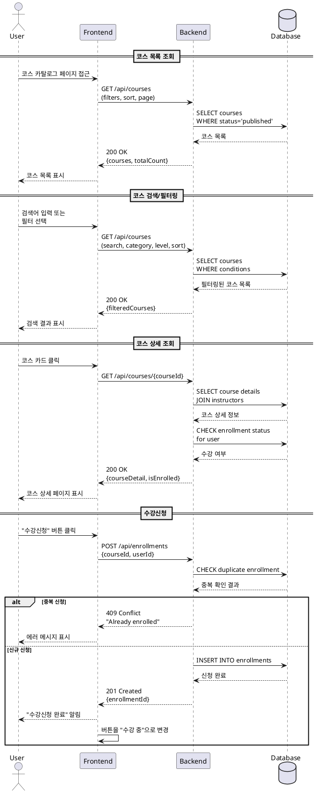

# 유스케이스: 코스 탐색 & 수강신청

## Primary Actor
- **Learner** (학습자)

## Precondition
- 사용자가 Learner 역할로 로그인된 상태
- 코스 카탈로그 페이지에 접근 가능한 상태

## Trigger
- Learner가 코스 카탈로그 페이지에 진입

## Main Scenario

### 1. 코스 목록 조회
1. Learner가 코스 카탈로그 페이지에 접근
2. 시스템이 published 상태의 코스 목록을 표시 (기본: 최신순 정렬)
3. 각 코스 카드에 제목, 강사명, 카테고리, 난이도, 간단한 설명 표시

### 2. 코스 검색 및 필터링
1. Learner가 검색어 입력 또는 필터 적용
   - 검색: 코스명, 강사명, 설명에서 키워드 검색
   - 필터: 카테고리(프로그래밍, 디자인 등), 난이도(초급/중급/고급)
   - 정렬: 최신순, 인기순(수강생 수 기준)
2. 시스템이 조건에 맞는 코스 목록 실시간 업데이트

### 3. 코스 상세 정보 확인
1. Learner가 관심 있는 코스 카드 클릭
2. 시스템이 코스 상세 페이지 표시
   - 코스 전체 설명, 커리큘럼 개요
   - 강사 정보
   - 수강생 수, 과제 수
   - 수강신청 상태 표시 (미등록/등록완료)

### 4. 수강신청 진행
1. Learner가 "수강신청" 버튼 클릭
2. 시스템이 중복 신청 여부 확인
3. 신청 가능한 경우 enrollments 테이블에 레코드 생성
4. 성공 메시지 표시 및 "내 코스" 목록에 추가
5. 버튼이 "수강 중"으로 변경

## Edge Cases

### E1. 이미 수강 중인 코스
- **상황**: 이미 등록된 코스에 재신청 시도
- **처리**: "이미 수강 중인 코스입니다" 알림, 신청 차단

### E2. 비공개 코스 접근
- **상황**: draft 상태의 코스에 직접 URL 접근
- **처리**: "존재하지 않는 코스입니다" 에러, 카탈로그로 리다이렉트

### E3. 삭제된 코스
- **상황**: 수강신청 과정 중 코스가 삭제됨
- **처리**: "더 이상 신청할 수 없는 코스입니다" 에러

### E4. 네트워크 오류
- **상황**: 수강신청 요청 중 네트워크 끊김
- **처리**: 재시도 옵션 제공, 로컬 스토리지에 임시 저장

## Business Rules

1. **코스 가시성**
   - published 상태의 코스만 Learner에게 노출
   - draft, archived 상태 코스는 검색/목록에서 제외

2. **수강신청 제한**
   - 동일 코스 중복 신청 불가
   - 한 번 신청한 코스는 취소 불가 (별도 정책 없는 한)

3. **정렬 및 필터 기본값**
   - 기본 정렬: 최신 게시순
   - 필터 미적용 시: 모든 카테고리, 모든 난이도 표시

4. **검색 범위**
   - 코스 제목, 설명, 강사명에서 부분 일치 검색
   - 대소문자 구분 없음

---

## Sequence Diagram

