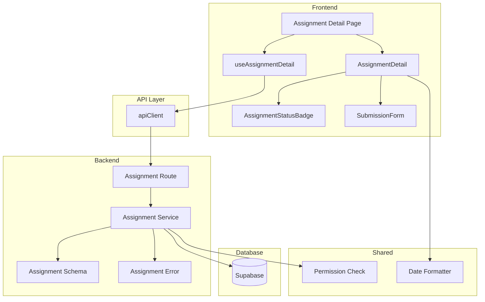

# 과제 상세 열람 기능 모듈화 설계

## 개요

### Backend 모듈

| 모듈 이름 | 위치 | 설명 |
|----------|------|------|
| Assignment Schema | `/src/features/assignments/backend/schema.ts` | 과제 관련 요청/응답 Zod 스키마 정의 |
| Assignment Error | `/src/features/assignments/backend/error.ts` | 과제 관련 에러 코드 정의 |
| Assignment Service | `/src/features/assignments/backend/service.ts` | 과제 비즈니스 로직 및 DB 접근 |
| Assignment Route | `/src/features/assignments/backend/route.ts` | Hono 라우터 정의 |
| Assignment DTO | `/src/features/assignments/lib/dto.ts` | 프론트엔드용 스키마 재노출 |

### Frontend 모듈

| 모듈 이름 | 위치 | 설명 |
|----------|------|------|
| Assignment Detail Hook | `/src/features/assignments/hooks/useAssignmentDetail.ts` | 과제 상세 정보 조회 React Query 훅 |
| Assignment Detail Component | `/src/features/assignments/components/AssignmentDetail.tsx` | 과제 상세 정보 표시 컴포넌트 |
| Assignment Status Badge | `/src/features/assignments/components/AssignmentStatusBadge.tsx` | 과제 상태 표시 배지 컴포넌트 |
| Submission Form Component | `/src/features/assignments/components/SubmissionForm.tsx` | 과제 제출 폼 컴포넌트 |

### Shared/Common 모듈

| 모듈 이름 | 위치 | 설명 |
|----------|------|------|
| Date Formatter | `/src/lib/date.ts` | 마감일 표시 포맷팅 유틸리티 |
| Permission Check | `/src/lib/permissions.ts` | 권한 검증 유틸리티 |

## Diagram



## Implementation Plan

### 1. Backend Schema (`/src/features/assignments/backend/schema.ts`)

**구현 내용:**
- `AssignmentDetailRequestSchema`: 과제 ID와 사용자 ID 검증
- `AssignmentDetailResponseSchema`: 과제 상세 정보 응답 스키마
- `AssignmentTableRowSchema`: DB 테이블 row 스키마
- `SubmissionTableRowSchema`: 제출물 테이블 row 스키마

**Unit Test 시나리오:**
- 유효한 UUID 형식 검증
- 필수 필드 존재 여부 검증
- enum 값 검증 (status, difficulty 등)

### 2. Backend Error (`/src/features/assignments/backend/error.ts`)

**구현 내용:**
```typescript
export const assignmentErrorCodes = {
  notFound: 'ASSIGNMENT_NOT_FOUND',
  unauthorized: 'ASSIGNMENT_UNAUTHORIZED',
  notEnrolled: 'NOT_ENROLLED_IN_COURSE',
  fetchError: 'ASSIGNMENT_FETCH_ERROR',
  invalidStatus: 'ASSIGNMENT_INVALID_STATUS',
} as const;
```

### 3. Backend Service (`/src/features/assignments/backend/service.ts`)

**구현 내용:**
- `getAssignmentDetail()`: 과제 상세 정보 조회
  - 과제 기본 정보 조회
  - 수강생 등록 여부 확인
  - 제출 가능 상태 계산
  - 기존 제출물 확인

**Unit Test 시나리오:**
- 등록된 수강생의 정상 조회
- 미등록 수강생 접근 차단
- draft 상태 과제 접근 차단
- closed 상태 과제 제출 불가 표시
- 지각 제출 정책 반영

### 4. Backend Route (`/src/features/assignments/backend/route.ts`)

**구현 내용:**
```typescript
GET /api/assignments/:id
- 헤더에서 사용자 ID 추출
- 과제 상세 정보 반환
- 에러 핸들링
```

### 5. Frontend Hook (`/src/features/assignments/hooks/useAssignmentDetail.ts`)

**구현 내용:**
- React Query 사용
- 자동 토큰 주입 (apiClient 활용)
- 캐싱 및 재시도 정책 설정

**QA Sheet:**
| 항목 | 체크 |
|------|------|
| 로딩 상태 표시 | [ ] |
| 에러 상태 처리 | [ ] |
| 네트워크 재시도 | [ ] |
| 캐시 무효화 | [ ] |

### 6. Assignment Detail Component (`/src/features/assignments/components/AssignmentDetail.tsx`)

**구현 내용:**
- 과제 정보 표시 (제목, 설명, 마감일, 점수 비중)
- 정책 표시 (지각 허용, 재제출 허용)
- 상태별 UI 분기
- 제출 폼 활성화/비활성화

**QA Sheet:**
| 항목 | 체크 |
|------|------|
| 로딩 스켈레톤 | [ ] |
| 에러 메시지 표시 | [ ] |
| 마감일 포맷팅 | [ ] |
| 상태 배지 표시 | [ ] |
| 반응형 레이아웃 | [ ] |

### 7. Submission Form Component (`/src/features/assignments/components/SubmissionForm.tsx`)

**구현 내용:**
- react-hook-form 사용
- Zod 스키마 검증
- 텍스트 필드 (필수)
- 링크 필드 (선택, URL 검증)
- 제출 버튼 상태 관리

**QA Sheet:**
| 항목 | 체크 |
|------|------|
| 필수 필드 검증 | [ ] |
| URL 형식 검증 | [ ] |
| 폼 제출 중 버튼 비활성화 | [ ] |
| 성공/실패 피드백 | [ ] |
| 마감 상태 체크 | [ ] |

### 8. Common Utilities

**Date Formatter (`/src/lib/date.ts`):**
- 마감일 표시 (D-day 형식)
- 상대 시간 표시
- date-fns 활용

**Permission Check (`/src/lib/permissions.ts`):**
- 수강생 역할 확인
- 과제 접근 권한 검증

## 테스트 전략

### Backend Tests
- Service 레이어 단위 테스트
- 권한 검증 로직 테스트
- 에러 케이스 처리 테스트

### Frontend Tests
- 컴포넌트 렌더링 테스트
- 사용자 인터랙션 테스트
- 폼 검증 테스트

### E2E Tests
- 과제 상세 페이지 접근 플로우
- 권한 없는 접근 시도
- 제출 폼 작동 확인

## 보안 고려사항

1. **권한 검증**
   - 서버 사이드에서 enrollment 확인
   - 역할 기반 접근 제어

2. **입력 검증**
   - XSS 방지를 위한 입력 sanitization
   - URL 형식 검증

3. **상태 검증**
   - 과제 상태별 접근 제한
   - 마감일 기반 제출 차단