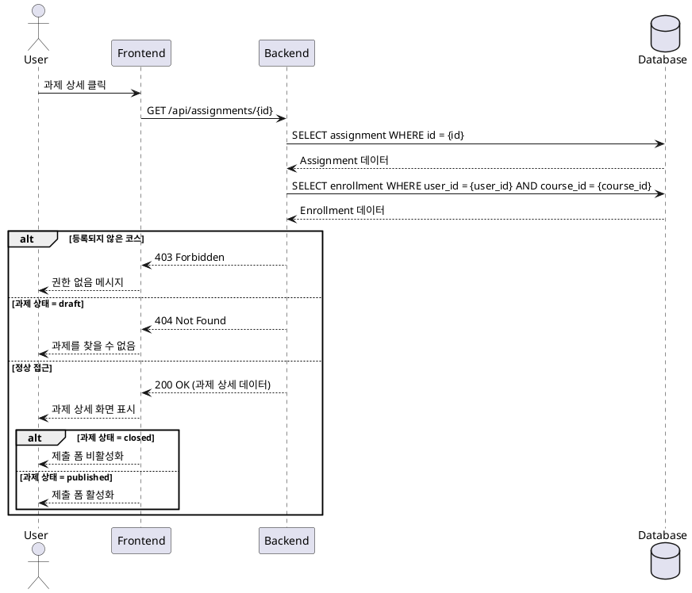

# 유스케이스: 과제 상세 열람

## Primary Actor
Learner (수강생)

## Precondition
- 수강생이 시스템에 로그인 완료
- 하나 이상의 코스에 등록되어 있음
- 해당 코스에 과제가 존재함

## Trigger
수강생이 내 코스 목록에서 특정 과제를 클릭

## Main Scenario
1. 수강생이 대시보드에서 "내 코스" 메뉴 선택
2. 등록된 코스 목록에서 특정 코스 선택
3. 코스 내 과제 목록 확인
4. 특정 과제 클릭하여 상세 페이지 진입
5. 과제 상세 정보 확인:
   - 과제 제목 및 설명
   - 제출 마감일
   - 점수 비중
   - 지각 제출 허용 여부
   - 재제출 허용 여부
6. 과제 상태에 따른 제출 인터페이스 표시:
   - 진행중: 제출 폼(텍스트 필드, 링크 필드) 활성화
   - 마감됨: 제출 폼 비활성화 및 안내 메시지 표시

## Edge Cases

### E1: 미등록 코스 접근 시도
- 발생: 수강 신청하지 않은 코스의 과제 직접 URL 접근
- 처리: 403 권한 없음 오류 표시, 코스 목록으로 리다이렉트

### E2: 미공개 과제 접근
- 발생: draft 상태의 과제 접근 시도
- 처리: 404 과제를 찾을 수 없음 메시지 표시

### E3: 삭제된 과제 접근
- 발생: 이미 삭제된 과제 URL 접근
- 처리: 404 과제를 찾을 수 없음 메시지 표시

### E4: 네트워크 오류
- 발생: API 요청 실패
- 처리: 재시도 버튼과 함께 오류 메시지 표시

## Business Rules

### BR1: 과제 접근 권한
- 수강생은 본인이 등록한 코스의 과제만 열람 가능
- published 상태의 과제만 수강생에게 표시

### BR2: 제출 가능 상태
- 과제 상태가 'published'이고 'closed'가 아닌 경우만 제출 가능
- 마감일 이후에는 지각 제출 정책에 따라 제출 가능 여부 결정

### BR3: 과제 정보 표시
- 모든 과제는 반드시 마감일 정보 포함
- 점수 비중은 0-100 범위로 표시
- 지각/재제출 정책은 boolean 값으로 명확히 표시

---

## Sequence Diagram

