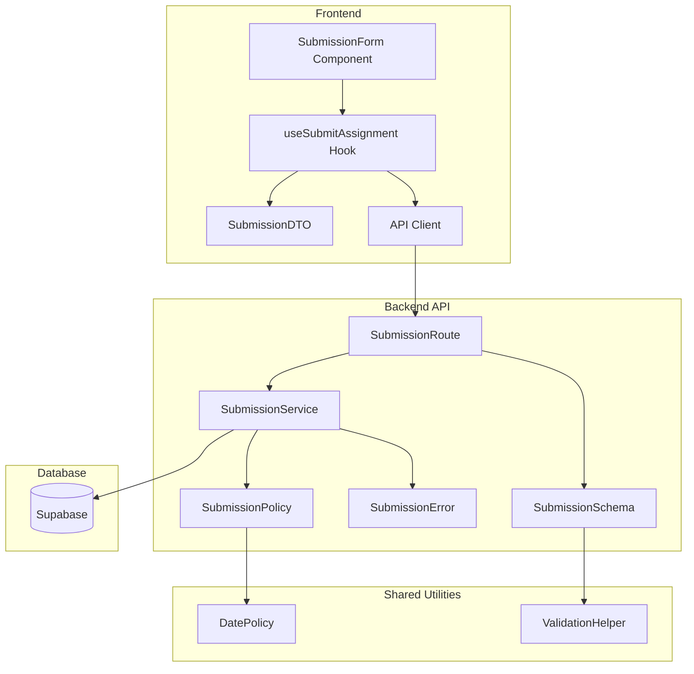

# 과제 제출 기능 모듈화 설계

## 개요

### Backend Modules

| 모듈명 | 위치 | 설명 |
|--------|------|------|
| **SubmissionSchema** | `src/features/submissions/backend/schema.ts` | 제출 요청/응답 Zod 스키마 정의 |
| **SubmissionError** | `src/features/submissions/backend/error.ts` | 제출 관련 에러 코드 정의 |
| **SubmissionService** | `src/features/submissions/backend/service.ts` | 제출 비즈니스 로직 (정책 검증, DB 작업) |
| **SubmissionRoute** | `src/features/submissions/backend/route.ts` | Hono 라우터 (POST /api/submissions) |
| **SubmissionPolicy** | `src/features/submissions/backend/policy.ts` | 제출 가능 여부 정책 검증 (재사용 가능) |

### Frontend Modules

| 모듈명 | 위치 | 설명 |
|--------|------|------|
| **useSubmitAssignment** | `src/features/submissions/hooks/useSubmitAssignment.ts` | 과제 제출 React Query hook |
| **SubmissionDTO** | `src/features/submissions/lib/dto.ts` | 프론트엔드 타입 재노출 |

### Shared/Generic Modules

| 모듈명 | 위치 | 설명 |
|--------|------|------|
| **DatePolicy** | `src/lib/policies/date.ts` | 마감일/지각 정책 검증 유틸리티 |
| **ValidationHelper** | `src/lib/validation/url.ts` | URL 검증 등 공통 유효성 검사 |

## Diagram



## Implementation Plan

### 1. Backend - SubmissionSchema
**파일**: `src/features/submissions/backend/schema.ts`

```typescript
// 제출 요청 스키마
export const SubmitAssignmentRequestSchema = z.object({
  assignmentId: z.string().uuid(),
  learnerId: z.string().uuid(),
  content: z.string().min(1).max(5000),
  link: z.string().url().nullable().optional()
});

// 제출 응답 스키마
export const SubmitAssignmentResponseSchema = z.object({
  submissionId: z.string().uuid(),
  status: z.enum(['submitted', 'resubmission']),
  isLate: z.boolean(),
  submittedAt: z.string()
});
```

**Unit Tests**:
- 유효한 제출 데이터 검증
- 필수 필드 누락 시 에러
- URL 형식 검증
- 텍스트 길이 제한 검증

### 2. Backend - SubmissionError
**파일**: `src/features/submissions/backend/error.ts`

```typescript
export const submissionErrorCodes = {
  notEnrolled: 'NOT_ENROLLED',
  assignmentNotFound: 'ASSIGNMENT_NOT_FOUND',
  assignmentClosed: 'ASSIGNMENT_CLOSED',
  pastDueNoLate: 'PAST_DUE_NO_LATE',
  resubmitNotAllowed: 'RESUBMIT_NOT_ALLOWED',
  validationFailed: 'VALIDATION_FAILED',
  submissionFailed: 'SUBMISSION_FAILED'
} as const;
```

### 3. Backend - SubmissionPolicy
**파일**: `src/features/submissions/backend/policy.ts`

```typescript
export interface SubmissionPolicyCheck {
  canSubmit: boolean;
  isLate: boolean;
  reason?: string;
}

export const checkSubmissionPolicy = (
  assignment: AssignmentRow,
  existingSubmission: SubmissionRow | null,
  now: Date = new Date()
): SubmissionPolicyCheck
```

**Unit Tests**:
- 정상 제출 (마감일 전)
- 지각 제출 (지각 허용)
- 제출 차단 (지각 불허)
- 재제출 허용/불허
- 과제 마감 상태

### 4. Backend - SubmissionService
**파일**: `src/features/submissions/backend/service.ts`

```typescript
export const submitAssignment = async (
  client: SupabaseClient,
  params: SubmitAssignmentRequest
): Promise<HandlerResult<SubmitAssignmentResponse, SubmissionServiceError>>
```

**비즈니스 로직**:
1. 과제 정보 조회
2. 수강 등록 확인
3. 기존 제출물 확인
4. 제출 정책 검증 (SubmissionPolicy 활용)
5. 제출물 저장/업데이트
6. 응답 반환

**Unit Tests**:
- 정상 제출 시나리오
- 수강 미등록 오류
- 마감일 초과 처리
- 재제출 시나리오
- 트랜잭션 롤백

### 5. Backend - SubmissionRoute
**파일**: `src/features/submissions/backend/route.ts`

```typescript
// POST /api/submissions
submissionRoutes.post('/', async (c) => {
  // 1. 인증 확인
  // 2. 요청 유효성 검증
  // 3. 서비스 호출
  // 4. 응답 반환
});
```

### 6. Frontend - useSubmitAssignment Hook
**파일**: `src/features/submissions/hooks/useSubmitAssignment.ts`

```typescript
export const useSubmitAssignment = () => {
  return useMutation({
    mutationFn: async (params: SubmitAssignmentParams) => {
      const response = await apiClient.post('/api/submissions', {
        json: params
      });

      if (!response.ok) {
        const error = await response.json();
        throw new Error(error.message);
      }

      return response.json();
    },
    onSuccess: () => {
      // 과제 상세 쿼리 무효화
      queryClient.invalidateQueries(['assignment']);
    }
  });
};
```

### 7. Shared - DatePolicy
**파일**: `src/lib/policies/date.ts`

```typescript
export const checkDeadlinePolicy = (
  dueDate: Date,
  allowLate: boolean,
  now: Date = new Date()
): {
  isPastDue: boolean;
  canSubmitLate: boolean;
}
```

### 8. Integration with SubmissionForm
**기존 컴포넌트 연동**:

```typescript
// AssignmentDetail.tsx에서 사용
const { mutate: submitAssignment } = useSubmitAssignment();

<SubmissionForm
  onSubmit={async (values) => {
    await submitAssignment({
      assignmentId,
      content: values.content,
      link: values.link
    });
  }}
/>
```

## QA Sheet (Frontend)

| 시나리오 | 입력 | 예상 동작 | 확인사항 |
|----------|------|-----------|----------|
| 정상 제출 | 텍스트 입력 + 제출 클릭 | 성공 메시지, 상태 업데이트 | 과제 상태가 "제출됨"으로 변경 |
| 텍스트 미입력 | 빈 텍스트 + 제출 클릭 | 에러 메시지 표시 | "과제 내용을 입력하세요" |
| 잘못된 URL | 텍스트 + 잘못된 URL | 에러 메시지 표시 | "올바른 URL 형식을 입력하세요" |
| 마감 후 제출 (지각 허용) | 마감일 지난 과제 제출 | 지각 제출 알림 | late=true 플래그 확인 |
| 마감 후 제출 (지각 불허) | 마감일 지난 과제 제출 | 제출 버튼 비활성화 | "제출 기한이 지났습니다" |
| 재제출 (허용) | 이미 제출한 과제 재제출 | 수정 제출 성공 | 기존 제출물 업데이트 |
| 재제출 (불허) | 이미 제출한 과제 재제출 | 제출 버튼 비활성화 | "재제출이 허용되지 않습니다" |
| 재제출 요청 | status=resubmission_required | 재제출 버튼 활성화 | "강사가 재제출을 요청했습니다" |
| 네트워크 오류 | 제출 중 네트워크 차단 | 오류 메시지 표시 | "제출 실패. 다시 시도하세요" |
| 미등록 학생 | 미등록 상태에서 제출 | 제출 버튼 비활성화 | "코스에 등록해야 합니다" |

## Unit Tests (Backend)

```typescript
// src/features/submissions/backend/__tests__/service.test.ts

describe('SubmissionService', () => {
  describe('submitAssignment', () => {
    it('should submit assignment successfully before deadline', async () => {
      // Given: 마감일 전, 등록된 학생
      // When: 제출 요청
      // Then: 성공 응답, status='submitted', isLate=false
    });

    it('should allow late submission when policy allows', async () => {
      // Given: 마감일 후, 지각 허용
      // When: 제출 요청
      // Then: 성공 응답, isLate=true
    });

    it('should reject submission after deadline when late not allowed', async () => {
      // Given: 마감일 후, 지각 불허
      // When: 제출 요청
      // Then: PAST_DUE_NO_LATE 에러
    });

    it('should allow resubmission when required by instructor', async () => {
      // Given: status='resubmission_required'
      // When: 재제출 요청
      // Then: 성공 응답, 기존 제출물 업데이트
    });

    it('should reject resubmission when not allowed', async () => {
      // Given: 재제출 불허, 이미 제출됨
      // When: 재제출 시도
      // Then: RESUBMIT_NOT_ALLOWED 에러
    });

    it('should reject submission from unenrolled student', async () => {
      // Given: 미등록 학생
      // When: 제출 요청
      // Then: NOT_ENROLLED 에러
    });

    it('should validate content and link format', async () => {
      // Given: 잘못된 형식의 데이터
      // When: 제출 요청
      // Then: VALIDATION_FAILED 에러
    });
  });
});
```

## 구현 우선순위

1. **Phase 1 - Core Backend**
   - SubmissionSchema 정의
   - SubmissionError 정의
   - SubmissionPolicy 구현
   - SubmissionService 구현
   - Unit tests 작성

2. **Phase 2 - API Layer**
   - SubmissionRoute 구현
   - Hono 앱에 라우터 등록
   - API 통합 테스트

3. **Phase 3 - Frontend Integration**
   - useSubmitAssignment hook 구현
   - SubmissionForm 컴포넌트와 연동
   - E2E 테스트

4. **Phase 4 - Polish**
   - 에러 메시지 개선
   - 로딩 상태 최적화
   - 성능 최적화