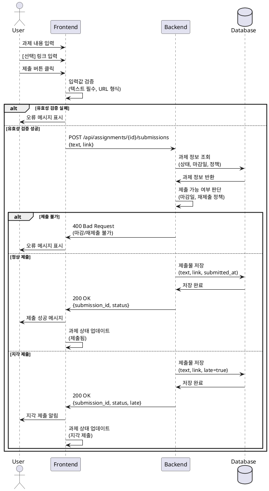

# 유스케이스: 과제 제출

## Primary Actor
- **학습자 (Learner)**

## Precondition
- 학습자가 로그인되어 있음
- 학습자가 해당 코스에 등록되어 있음
- 과제가 게시 상태(published)임
- 과제 상세 페이지에 접근 완료

## Trigger
- 학습자가 과제 제출 버튼을 클릭

## Main Scenario

1. 학습자가 과제 내용(텍스트)을 입력란에 작성
2. [선택] 학습자가 참고 링크 URL을 추가 입력
3. 학습자가 "제출" 버튼 클릭
4. 시스템이 입력값 유효성 검증
   - 텍스트 필드 필수 입력 확인
   - 링크 필드 URL 형식 검증 (입력 시)
5. 시스템이 제출 정책 확인
   - 마감일 확인
   - 재제출 정책 확인
6. 시스템이 제출물 저장
7. 제출 성공 메시지 표시
8. 과제 상태를 "제출됨"으로 업데이트

## Edge Cases

### 마감일 초과
- **정상 마감 후 + 지각 허용**: 지각 제출로 처리 (late=true 플래그)
- **정상 마감 후 + 지각 불허**: 제출 차단, 오류 메시지 표시

### 재제출 시도
- **재제출 허용**: 기존 제출물 업데이트 또는 새 버전 생성
- **재제출 불허**: 제출 차단, "이미 제출됨" 오류 표시

### 유효성 검증 실패
- **텍스트 미입력**: "과제 내용을 입력하세요" 오류 표시
- **잘못된 URL 형식**: "올바른 URL 형식을 입력하세요" 오류 표시

### 시스템 오류
- **네트워크 오류**: "제출 실패. 다시 시도하세요" 메시지
- **서버 오류**: "서버 오류. 잠시 후 다시 시도하세요" 메시지

## Business Rules

1. **필수 입력**: 텍스트 필드는 반드시 입력
2. **링크 형식**: URL은 http:// 또는 https://로 시작
3. **마감일 정책**:
   - 마감일 전: 정상 제출 (status=submitted)
   - 마감일 후 + 지각 허용: 지각 제출 (status=submitted, late=true)
   - 마감일 후 + 지각 불허: 제출 차단
4. **재제출 정책**:
   - 재제출 허용: 여러 번 제출 가능
   - 재제출 불허: 최초 1회만 제출 가능
5. **과제 상태**: published 상태의 과제만 제출 가능
6. **과제 마감**: closed 상태 과제는 제출 불가

## Sequence Diagram

