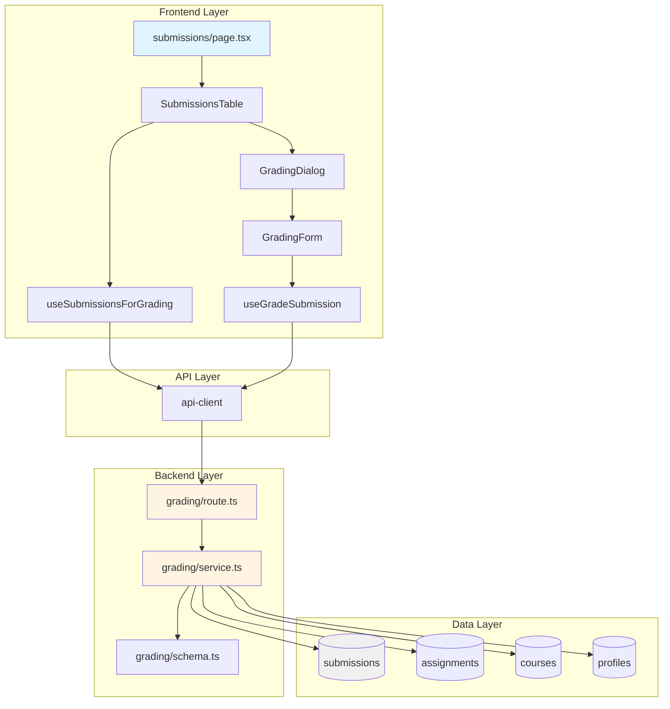

# 과제 채점 & 피드백 기능 모듈화 설계

## 개요

### 구현 목표
강사가 본인 코스의 과제 제출물을 조회하고 채점(점수, 피드백)을 제공하며, 필요 시 재제출을 요청할 수 있는 기능 구현

### 핵심 요구사항
1. 제출물 목록 조회 (instructor 권한, 본인 코스만)
2. 채점 처리 (점수 0~100, 피드백 필수, 재제출 요청 옵션)
3. 상태 전환 (submitted → graded / resubmission_required)
4. 권한 검증 (본인 소유 코스만 접근)
5. 실시간 학습자 가시성 (채점 완료 즉시 확인 가능)

### 모듈 목록

#### Backend (Hono + Supabase)
| 모듈 | 위치 | 설명 |
|------|------|------|
| Route | `src/features/grading/backend/route.ts` | 채점 API 엔드포인트 |
| Service | `src/features/grading/backend/service.ts` | 비즈니스 로직 및 권한 검증 |
| Schema | `src/features/grading/backend/schema.ts` | Zod 스키마 정의 |
| Error | `src/features/grading/backend/error.ts` | 에러 코드 상수 |

#### Frontend (React + React Query)
| 모듈 | 위치 | 설명 |
|------|------|------|
| Hooks - List | `src/features/grading/hooks/useSubmissionsForGrading.ts` | 제출물 목록 조회 훅 |
| Hooks - Grade | `src/features/grading/hooks/useGradeSubmission.ts` | 채점 처리 훅 |
| Component - Table | `src/features/grading/components/SubmissionsTable.tsx` | 제출물 목록 테이블 |
| Component - Form | `src/features/grading/components/GradingForm.tsx` | 채점 폼 |
| Component - Dialog | `src/features/grading/components/GradingDialog.tsx` | 채점 다이얼로그 |
| DTO | `src/features/grading/lib/dto.ts` | 스키마 재노출 |

#### Page (Next.js App Router)
| 모듈 | 위치 | 설명 |
|------|------|------|
| Submissions Page | `src/app/instructor/assignments/[id]/submissions/page.tsx` | 제출물 목록 및 채점 페이지 |

#### Shared
- 기존 `submissions` 테이블 활용 (DB 변경 불필요)
- 기존 `@/backend/http/response` 헬퍼 재사용
- 기존 `@/lib/remote/api-client` 재사용

## Diagram



## Implementation Plan

### 1. Backend - Schema (`src/features/grading/backend/schema.ts`)

#### 구현 내용
```typescript
// 제출물 목록 조회 응답
export const SubmissionForGradingSchema = z.object({
  id: z.string().uuid(),
  assignmentId: z.string().uuid(),
  learnerId: z.string().uuid(),
  learnerName: z.string(),
  content: z.string(),
  link: z.string().nullable(),
  isLate: z.boolean(),
  status: z.enum(['submitted', 'graded', 'resubmission_required']),
  score: z.number().min(0).max(100).nullable(),
  feedback: z.string().nullable(),
  submittedAt: z.string(),
  gradedAt: z.string().nullable(),
});

// 채점 요청
export const GradeSubmissionRequestSchema = z.object({
  score: z.number().int().min(0).max(100),
  feedback: z.string().min(1, '피드백을 입력하세요'),
  requestResubmission: z.boolean().default(false),
});

// 채점 응답
export const GradeSubmissionResponseSchema = z.object({
  submissionId: z.string().uuid(),
  status: z.enum(['graded', 'resubmission_required']),
  score: z.number().min(0).max(100),
  gradedAt: z.string(),
});
```

#### Unit Test
```typescript
describe('GradingSchema', () => {
  it('should validate valid grade request', () => {
    const valid = { score: 85, feedback: 'Good work!', requestResubmission: false };
    expect(GradeSubmissionRequestSchema.safeParse(valid).success).toBe(true);
  });

  it('should reject score out of range', () => {
    const invalid = { score: 101, feedback: 'Good', requestResubmission: false };
    expect(GradeSubmissionRequestSchema.safeParse(invalid).success).toBe(false);
  });

  it('should reject empty feedback', () => {
    const invalid = { score: 85, feedback: '', requestResubmission: false };
    expect(GradeSubmissionRequestSchema.safeParse(invalid).success).toBe(false);
  });
});
```

---

### 2. Backend - Error (`src/features/grading/backend/error.ts`)

#### 구현 내용
```typescript
export const gradingErrorCodes = {
  unauthorized: 'UNAUTHORIZED',
  forbidden: 'FORBIDDEN',
  assignmentNotFound: 'ASSIGNMENT_NOT_FOUND',
  submissionNotFound: 'SUBMISSION_NOT_FOUND',
  validationFailed: 'VALIDATION_FAILED',
  gradingFailed: 'GRADING_FAILED',
  databaseError: 'DATABASE_ERROR',
} as const;

export type GradingServiceError = (typeof gradingErrorCodes)[keyof typeof gradingErrorCodes];
```

---

### 3. Backend - Service (`src/features/grading/backend/service.ts`)

#### 구현 내용
```typescript
// 1. 제출물 목록 조회 (instructor 권한 검증)
export const getSubmissionsForGrading = async (
  client: SupabaseClient,
  assignmentId: string,
  instructorId: string
): Promise<HandlerResult<SubmissionForGrading[], GradingServiceError, unknown>>

// 2. 채점 처리 (권한 검증 + 상태 전환)
export const gradeSubmission = async (
  client: SupabaseClient,
  submissionId: string,
  gradeData: GradeSubmissionRequest,
  instructorId: string
): Promise<HandlerResult<GradeSubmissionResponse, GradingServiceError, unknown>>
```

#### 비즈니스 로직
**getSubmissionsForGrading**
1. instructor 프로필 조회 (role 검증)
2. assignment 조회 및 instructor 소유 여부 확인
3. submissions 목록 조회 (learner 정보 JOIN)
4. 응답 반환

**gradeSubmission**
1. instructor 프로필 조회 (role 검증)
2. submission 조회
3. assignment → course → instructor 권한 검증
4. 상태 결정 (requestResubmission에 따라)
5. submissions 업데이트 (score, feedback, status, graded_at)
6. 응답 반환

#### Unit Test
```typescript
describe('GradingService', () => {
  describe('getSubmissionsForGrading', () => {
    it('should return submissions for valid instructor', async () => {
      // Mock Supabase client
      // Test successful retrieval
    });

    it('should reject non-instructor user', async () => {
      // Test role validation
    });

    it('should reject instructor accessing other instructor\'s course', async () => {
      // Test ownership validation
    });
  });

  describe('gradeSubmission', () => {
    it('should grade submission with score and feedback', async () => {
      // Test successful grading
    });

    it('should set status to resubmission_required when requested', async () => {
      // Test resubmission request
    });

    it('should reject grading for non-owned course', async () => {
      // Test ownership validation
    });

    it('should update graded_at timestamp', async () => {
      // Test timestamp update
    });
  });
});
```

---

### 4. Backend - Route (`src/features/grading/backend/route.ts`)

#### 구현 내용
```typescript
// GET /api/grading/assignments/:assignmentId/submissions
gradingRoutes.get('/assignments/:assignmentId/submissions', async (c) => {
  // 1. x-user-id 헤더 검증
  // 2. assignmentId 검증
  // 3. service 호출
  // 4. respond 반환
});

// POST /api/grading/submissions/:submissionId
gradingRoutes.post('/submissions/:submissionId', async (c) => {
  // 1. x-user-id 헤더 검증
  // 2. submissionId 검증
  // 3. 요청 body 검증
  // 4. service 호출
  // 5. respond 반환
});

export const registerGradingRoutes = (app: Hono<AppEnv>) => {
  app.route('/api/grading', gradingRoutes);
};
```

#### 통합 위치
`src/backend/hono/app.ts`에 다음 추가:
```typescript
import { registerGradingRoutes } from '@/features/grading/backend/route';

registerGradingRoutes(app);
```

---

### 5. Frontend - DTO (`src/features/grading/lib/dto.ts`)

#### 구현 내용
```typescript
export {
  SubmissionForGradingSchema,
  GradeSubmissionRequestSchema,
  GradeSubmissionResponseSchema,
  type SubmissionForGrading,
  type GradeSubmissionRequest,
  type GradeSubmissionResponse,
} from '@/features/grading/backend/schema';
```

---

### 6. Frontend - Hooks (`src/features/grading/hooks/useSubmissionsForGrading.ts`)

#### 구현 내용
```typescript
export const useSubmissionsForGrading = (assignmentId: string) => {
  return useQuery({
    queryKey: ['grading', 'assignments', assignmentId, 'submissions'],
    queryFn: async () => {
      // 1. Supabase session 가져오기
      // 2. API 요청 (x-user-id 헤더)
      // 3. 응답 검증 및 반환
    },
    enabled: !!assignmentId,
  });
};
```

---

### 7. Frontend - Hooks (`src/features/grading/hooks/useGradeSubmission.ts`)

#### 구현 내용
```typescript
export const useGradeSubmission = () => {
  const queryClient = useQueryClient();

  return useMutation({
    mutationFn: async (params: {
      submissionId: string;
      data: GradeSubmissionRequest
    }) => {
      // 1. Supabase session 가져오기
      // 2. API 요청 (x-user-id 헤더)
      // 3. 응답 검증 및 반환
    },
    onSuccess: (data, variables) => {
      // 제출물 목록 쿼리 무효화
      queryClient.invalidateQueries({ queryKey: ['grading'] });
    },
  });
};
```

---

### 8. Frontend - Component (`src/features/grading/components/GradingForm.tsx`)

#### 구현 내용
```typescript
interface GradingFormProps {
  submission: SubmissionForGrading;
  onSubmit: (data: GradeSubmissionRequest) => Promise<void>;
  onCancel: () => void;
}

export const GradingForm: React.FC<GradingFormProps> = ({
  submission,
  onSubmit,
  onCancel,
}) => {
  // react-hook-form + zod
  // 점수 입력 (Input, 0-100)
  // 피드백 입력 (Textarea, 필수)
  // 재제출 요청 (Checkbox)
  // 제출 버튼
};
```

#### QA Sheet
| 항목 | 검증 내용 | 예상 결과 |
|------|----------|----------|
| 점수 유효성 | 0 미만 입력 | "0~100 사이 값을 입력하세요" 오류 |
| 점수 유효성 | 100 초과 입력 | "0~100 사이 값을 입력하세요" 오류 |
| 점수 유효성 | 50 입력 | 통과 |
| 피드백 필수 | 빈 문자열 제출 | "피드백을 입력하세요" 오류 |
| 피드백 필수 | "Good work!" 입력 | 통과 |
| 재제출 요청 | 체크박스 선택 | requestResubmission: true 전송 |
| 재제출 요청 | 체크박스 미선택 | requestResubmission: false 전송 |
| 제출 성공 | 유효한 데이터 제출 | "채점이 완료되었습니다" 성공 메시지 |
| 네트워크 오류 | API 실패 | "저장 실패. 다시 시도하세요" 오류 메시지 |

---

### 9. Frontend - Component (`src/features/grading/components/SubmissionsTable.tsx`)

#### 구현 내용
```typescript
interface SubmissionsTableProps {
  assignmentId: string;
  onGradeClick: (submission: SubmissionForGrading) => void;
}

export const SubmissionsTable: React.FC<SubmissionsTableProps> = ({
  assignmentId,
  onGradeClick,
}) => {
  const { data, isLoading, error } = useSubmissionsForGrading(assignmentId);

  // Table 컴포넌트 (shadcn-ui)
  // Columns: 학습자명, 제출일, 지각여부, 상태, 점수, 액션
  // 필터: 미채점/지각/재제출요청
  // 정렬: 제출일
};
```

#### QA Sheet
| 항목 | 검증 내용 | 예상 결과 |
|------|----------|----------|
| 로딩 상태 | 데이터 로딩 중 | 스켈레톤 표시 |
| 빈 목록 | 제출물 없음 | "제출물이 없습니다" 메시지 |
| 제출물 표시 | 제출물 3개 | 3개 행 표시 |
| 지각 뱃지 | isLate: true | "지각" 뱃지 표시 (빨간색) |
| 상태 뱃지 | submitted | "제출됨" 뱃지 (파란색) |
| 상태 뱃지 | graded | "채점완료" 뱃지 (녹색) |
| 상태 뱃지 | resubmission_required | "재제출요청" 뱃지 (주황색) |
| 채점 버튼 | submitted 상태 | "채점" 버튼 활성화 |
| 채점 버튼 | graded 상태 | "재채점" 버튼 활성화 |
| 채점 버튼 클릭 | 버튼 클릭 | GradingDialog 오픈 |

---

### 10. Frontend - Component (`src/features/grading/components/GradingDialog.tsx`)

#### 구현 내용
```typescript
interface GradingDialogProps {
  submission: SubmissionForGrading | null;
  isOpen: boolean;
  onClose: () => void;
}

export const GradingDialog: React.FC<GradingDialogProps> = ({
  submission,
  isOpen,
  onClose,
}) => {
  const { mutateAsync } = useGradeSubmission();

  const handleSubmit = async (data: GradeSubmissionRequest) => {
    await mutateAsync({ submissionId: submission.id, data });
    onClose();
  };

  // Dialog 컴포넌트 (shadcn-ui)
  // 제출물 정보 표시 (학습자명, 제출일, 내용, 링크)
  // GradingForm 렌더링
};
```

#### QA Sheet
| 항목 | 검증 내용 | 예상 결과 |
|------|----------|----------|
| 다이얼로그 오픈 | isOpen: true | 다이얼로그 표시 |
| 다이얼로그 닫기 | X 버튼 클릭 | 다이얼로그 닫힘 |
| 제출물 정보 | submission 전달 | 학습자명, 제출일, 내용 표시 |
| 폼 제출 | 유효한 데이터 제출 | API 호출 후 다이얼로그 닫힘 |
| 폼 제출 실패 | API 오류 | 오류 메시지 표시, 다이얼로그 유지 |

---

### 11. Page (`src/app/instructor/assignments/[id]/submissions/page.tsx`)

#### 구현 내용
```typescript
export default async function SubmissionsPage(props: {
  params: Promise<{ id: string }>;
}) {
  const params = await props.params;
  const assignmentId = params.id;

  return (
    <div>
      <header>
        <h1>제출물 관리</h1>
      </header>
      <main>
        <SubmissionsTable
          assignmentId={assignmentId}
          onGradeClick={(submission) => {
            // GradingDialog 오픈
          }}
        />
        <GradingDialog
          submission={selectedSubmission}
          isOpen={isDialogOpen}
          onClose={() => setIsDialogOpen(false)}
        />
      </main>
    </div>
  );
}
```

#### QA Sheet
| 항목 | 검증 내용 | 예상 결과 |
|------|----------|----------|
| 페이지 로딩 | /instructor/assignments/{id}/submissions 접근 | 제출물 목록 페이지 표시 |
| 권한 검증 | learner 계정 접근 | 403 또는 리다이렉트 |
| 권한 검증 | 다른 instructor 접근 | 403 또는 빈 목록 |
| 권한 검증 | 본인 instructor 접근 | 제출물 목록 표시 |
| 채점 플로우 | 제출물 선택 → 채점 → 저장 | 목록 갱신, 성공 메시지 |

---

## Implementation Order

### Phase 1: Backend (1-2일)
1. Schema 정의 (`schema.ts`)
2. Error 코드 정의 (`error.ts`)
3. Service 구현 (`service.ts`)
4. Route 구현 (`route.ts`)
5. Hono 앱 통합 (`app.ts`)
6. Unit Test 작성 및 실행

### Phase 2: Frontend Hooks & Utils (1일)
1. DTO 재노출 (`dto.ts`)
2. useSubmissionsForGrading 구현
3. useGradeSubmission 구현

### Phase 3: Frontend Components (2-3일)
1. GradingForm 구현 및 QA
2. SubmissionsTable 구현 및 QA
3. GradingDialog 구현 및 QA

### Phase 4: Page & Integration (1일)
1. Page 구현 (`page.tsx`)
2. 전체 플로우 QA
3. Edge Case 테스트

### Phase 5: Polish & Review (1일)
1. 에러 핸들링 강화
2. 로딩 상태 최적화
3. 코드 리뷰 및 리팩토링

## 예상 총 소요 시간
**6~8일** (1인 개발 기준)

## Dependencies
- 기존 모듈: `submissions`, `assignments`, `courses`, `profiles`
- Supabase 테이블: 변경 불필요
- 새 패키지 설치: 불필요
