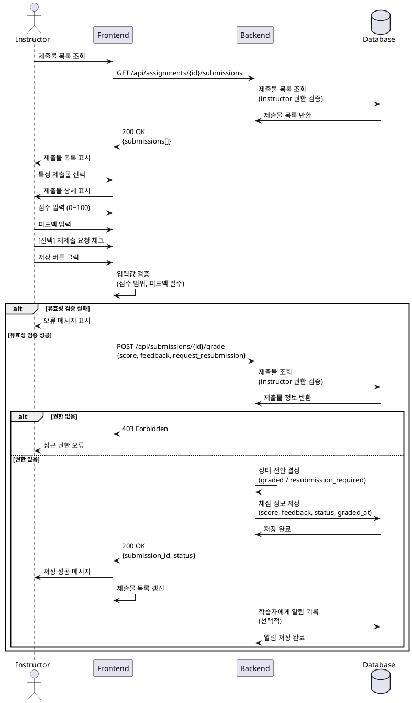

# 유스케이스: 과제 채점 & 피드백

## Primary Actor
- **강사 (Instructor)**

## Precondition
- 강사가 로그인되어 있음
- 강사가 본인 소유 코스의 과제에 접근
- 해당 과제에 학습자 제출물이 존재
- 제출물이 submitted 상태임

## Trigger
- 강사가 제출물 목록에서 특정 제출물을 선택하고 채점 인터페이스에 진입

## Main Scenario

1. 강사가 대시보드에서 특정 Assignment의 제출물 목록 조회
2. 강사가 채점할 제출물 선택
3. 시스템이 제출물 상세 정보 표시 (학습자명, 제출일, 지각 여부, 제출 내용)
4. 강사가 점수 입력 (0~100)
5. 강사가 피드백 입력 (텍스트, 필수)
6. [선택] 강사가 "재제출 요청" 옵션 선택
7. 강사가 "저장" 버튼 클릭
8. 시스템이 입력값 유효성 검증 (점수 범위, 피드백 필수)
9. 시스템이 상태 전환
   - 재제출 요청 없음 → `graded`
   - 재제출 요청 선택 → `resubmission_required`
10. 시스템이 채점 결과 저장
11. 성공 메시지 표시
12. 학습자 화면에 피드백 및 상태 반영

## Edge Cases

### 점수 범위 오류
- **0 미만 또는 100 초과**: "점수는 0~100 사이 값을 입력하세요" 오류 표시

### 피드백 미입력
- **피드백 필수**: "피드백을 입력하세요" 오류 표시

### 권한 오류
- **본인 코스가 아닌 경우**: 403 Forbidden, "접근 권한이 없습니다" 오류 표시

### 이미 채점된 제출물
- **재채점 허용**: 기존 점수/피드백 덮어쓰기
- **이력 추적**: updated_at 갱신

### 재제출 요청 후 처리
- **학습자가 재제출**: 기존 채점은 유지되고, 새 제출물은 submitted 상태로 생성
- **재제출 전 상태**: resubmission_required 유지

### 시스템 오류
- **네트워크 오류**: "저장 실패. 다시 시도하세요" 메시지
- **서버 오류**: "서버 오류. 잠시 후 다시 시도하세요" 메시지

## Business Rules

1. **접근 권한**: Instructor 본인 소유 코스의 제출물만 채점 가능
2. **점수 범위**: 0~100 정수값
3. **피드백 필수**: 빈 문자열 불가
4. **상태 전환 규칙**:
   - 점수 입력 + 재제출 요청 없음 → `graded`
   - 재제출 요청 선택 → `resubmission_required`
5. **학습자 가시성**: 채점 완료 즉시 학습자가 점수/피드백 확인 가능
6. **재제출 흐름**: resubmission_required 상태에서 학습자는 다시 제출 가능 (재제출 정책 무관)
7. **이력 관리**: 채점 시각 (graded_at) 및 수정 시각 (updated_at) 기록

## Sequence Diagram

