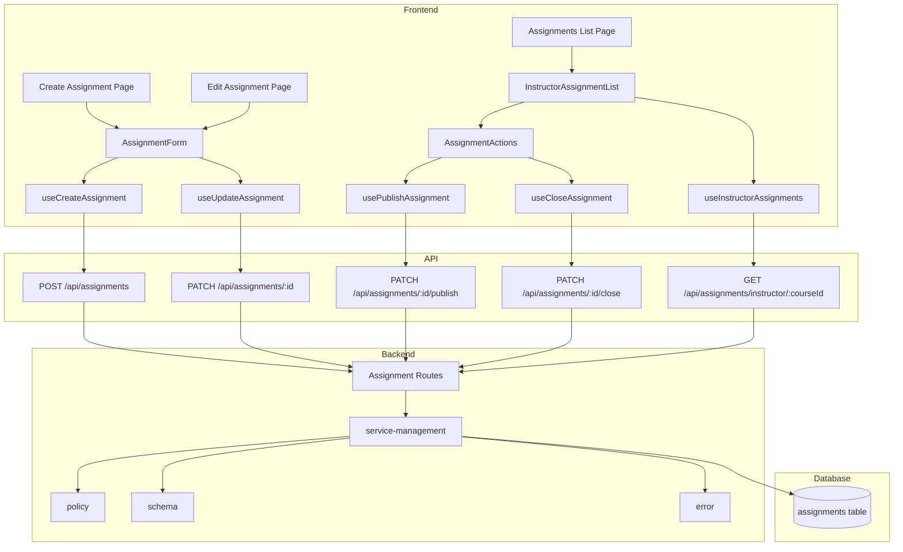

# Assignment 게시/마감 기능 구현 계획

## 개요

Assignment 생성, 수정, 게시, 마감 기능을 구현하기 위한 모듈 설계

### Backend Modules

| 모듈 | 위치 | 설명 |
|------|------|------|
| Assignment Management Service | `src/features/assignments/backend/service-management.ts` | 과제 생성/수정/게시/마감 비즈니스 로직 |
| Assignment Routes | `src/features/assignments/backend/route.ts` | POST, PATCH 라우트 추가 |
| Assignment Schema | `src/features/assignments/backend/schema.ts` | 생성/수정/게시/마감 요청/응답 스키마 추가 |
| Assignment Policy | `src/features/assignments/backend/policy.ts` | 날짜 검증, 권한 검증 정책 |
| Assignment Error | `src/features/assignments/backend/error.ts` | 에러 코드 추가 |

### Frontend Modules - Pages

| 모듈 | 위치 | 설명 |
|------|------|------|
| Instructor Assignments List | `src/app/instructor/courses/[id]/assignments/page.tsx` | 코스별 과제 목록 (Instructor용) |
| Create Assignment | `src/app/instructor/courses/[id]/assignments/new/page.tsx` | 과제 생성 페이지 |
| Edit Assignment | `src/app/instructor/courses/[id]/assignments/[assignmentId]/edit/page.tsx` | 과제 수정 페이지 |

### Frontend Modules - Components

| 모듈 | 위치 | 설명 |
|------|------|------|
| Assignment Form | `src/features/assignments/components/AssignmentForm.tsx` | 과제 생성/수정 폼 (공통) |
| Instructor Assignment List | `src/features/assignments/components/InstructorAssignmentList.tsx` | Instructor용 과제 목록 컴포넌트 |
| Assignment Actions | `src/features/assignments/components/AssignmentActions.tsx` | 게시/마감 액션 버튼 |
| Assignment Status Badge | `src/features/assignments/components/AssignmentStatusBadge.tsx` | 상태 뱃지 (기존 활용) |

### Frontend Modules - Hooks

| 모듈 | 위치 | 설명 |
|------|------|------|
| Create Assignment Hook | `src/features/assignments/hooks/useCreateAssignment.ts` | 과제 생성 React Query 훅 |
| Update Assignment Hook | `src/features/assignments/hooks/useUpdateAssignment.ts` | 과제 수정 React Query 훅 |
| Publish Assignment Hook | `src/features/assignments/hooks/usePublishAssignment.ts` | 과제 게시 React Query 훅 |
| Close Assignment Hook | `src/features/assignments/hooks/useCloseAssignment.ts` | 과제 마감 React Query 훅 |
| Instructor Assignments Hook | `src/features/assignments/hooks/useInstructorAssignments.ts` | Instructor용 과제 목록 조회 훅 |

### Shared Modules

| 모듈 | 위치 | 설명 |
|------|------|------|
| DTO Export | `src/features/assignments/lib/dto.ts` | Backend 스키마 재노출 (수정) |

## Diagram



## Implementation Plan

### 1. Backend - Schema (src/features/assignments/backend/schema.ts)

**작업 내용:**
- `CreateAssignmentRequestSchema` 추가
- `UpdateAssignmentRequestSchema` 추가
- `PublishAssignmentRequestSchema` 추가 (빈 객체 또는 게시일 포함)
- `CloseAssignmentRequestSchema` 추가 (빈 객체)
- `AssignmentManagementResponseSchema` 추가

**Unit Test:**
```typescript
// Schema validation tests
describe('CreateAssignmentRequestSchema', () => {
  it('should validate valid assignment creation request', () => {
    const valid = {
      courseId: 'uuid',
      title: 'Assignment 1',
      description: 'Description',
      dueDate: '2025-12-31T23:59:59Z',
      weight: 20,
      allowLate: true,
      allowResubmission: false,
    };
    expect(CreateAssignmentRequestSchema.safeParse(valid).success).toBe(true);
  });

  it('should reject when required fields are missing', () => {
    const invalid = { courseId: 'uuid' };
    expect(CreateAssignmentRequestSchema.safeParse(invalid).success).toBe(false);
  });

  it('should reject when weight is out of range', () => {
    const invalid = { weight: 150 };
    expect(CreateAssignmentRequestSchema.safeParse(invalid).success).toBe(false);
  });

  it('should reject when due date is in past', () => {
    const invalid = { dueDate: '2020-01-01T00:00:00Z' };
    // Note: 날짜 검증은 policy에서 처리
  });
});
```

### 2. Backend - Policy (src/features/assignments/backend/policy.ts)

**작업 내용:**
- `validateAssignmentDates(dueDate: string): PolicyResult` - 마감일 검증 (미래 날짜)
- `checkInstructorPermission(client, courseId, instructorId): Promise<PolicyResult>` - 코스 소유권 검증
- `checkAssignmentEditPermission(assignment): PolicyResult` - 수정 가능 여부 (마감 후 수정 불가)

**Unit Test:**
```typescript
describe('validateAssignmentDates', () => {
  it('should allow future due dates', () => {
    const futureDate = new Date(Date.now() + 86400000).toISOString();
    expect(validateAssignmentDates(futureDate).valid).toBe(true);
  });

  it('should reject past due dates', () => {
    const pastDate = new Date(Date.now() - 86400000).toISOString();
    expect(validateAssignmentDates(pastDate).valid).toBe(false);
  });
});

describe('checkInstructorPermission', () => {
  it('should allow course owner', async () => {
    // Mock Supabase client
    const result = await checkInstructorPermission(mockClient, courseId, ownerId);
    expect(result.valid).toBe(true);
  });

  it('should reject non-owner', async () => {
    const result = await checkInstructorPermission(mockClient, courseId, nonOwnerId);
    expect(result.valid).toBe(false);
  });
});
```

### 3. Backend - Service Management (src/features/assignments/backend/service-management.ts)

**작업 내용:**
- `createAssignment(client, data, instructorId): HandlerResult<AssignmentResponse>`
  1. 권한 검증 (checkInstructorPermission)
  2. 날짜 검증 (validateAssignmentDates)
  3. DB INSERT (status: 'draft')
  4. 응답 반환

- `updateAssignment(client, assignmentId, data, instructorId): HandlerResult<AssignmentResponse>`
  1. 과제 조회
  2. 권한 검증
  3. 수정 가능 여부 검증 (checkAssignmentEditPermission)
  4. 날짜 검증 (변경된 경우)
  5. DB UPDATE
  6. 응답 반환

- `publishAssignment(client, assignmentId, instructorId): HandlerResult<AssignmentResponse>`
  1. 과제 조회
  2. 권한 검증
  3. 이미 게시/마감 상태 확인
  4. status를 'published'로 UPDATE
  5. 응답 반환

- `closeAssignment(client, assignmentId, instructorId): HandlerResult<AssignmentResponse>`
  1. 과제 조회
  2. 권한 검증
  3. 게시 상태 확인 (draft는 마감 불가)
  4. status를 'closed'로 UPDATE
  5. 응답 반환

- `getInstructorAssignments(client, courseId, instructorId): HandlerResult<AssignmentResponse[]>`
  1. 권한 검증
  2. 코스별 전체 과제 조회 (draft 포함)
  3. 제출 통계 포함 (총 제출 수, 채점 완료 수 등)
  4. 응답 반환

**Unit Test:**
```typescript
describe('createAssignment', () => {
  it('should create assignment with valid data', async () => {
    const result = await createAssignment(mockClient, validData, instructorId);
    expect(result.ok).toBe(true);
    expect(result.data?.status).toBe('draft');
  });

  it('should reject when instructor does not own course', async () => {
    const result = await createAssignment(mockClient, validData, nonOwnerId);
    expect(result.ok).toBe(false);
    expect(result.error?.code).toBe('PERMISSION_DENIED');
  });

  it('should reject when due date is in past', async () => {
    const pastData = { ...validData, dueDate: '2020-01-01T00:00:00Z' };
    const result = await createAssignment(mockClient, pastData, instructorId);
    expect(result.ok).toBe(false);
  });
});

describe('publishAssignment', () => {
  it('should publish draft assignment', async () => {
    const result = await publishAssignment(mockClient, draftAssignmentId, instructorId);
    expect(result.ok).toBe(true);
    expect(result.data?.status).toBe('published');
  });

  it('should reject when already published', async () => {
    const result = await publishAssignment(mockClient, publishedAssignmentId, instructorId);
    expect(result.ok).toBe(false);
  });
});
```

### 4. Backend - Routes (src/features/assignments/backend/route.ts)

**작업 내용:**
- `POST /api/assignments` - 과제 생성
  - x-user-id 헤더 검증
  - Body 검증 (CreateAssignmentRequestSchema)
  - createAssignment 호출

- `PATCH /api/assignments/:id` - 과제 수정
  - x-user-id 헤더 검증
  - assignmentId 검증
  - Body 검증 (UpdateAssignmentRequestSchema)
  - updateAssignment 호출

- `PATCH /api/assignments/:id/publish` - 과제 게시
  - x-user-id 헤더 검증
  - assignmentId 검증
  - publishAssignment 호출

- `PATCH /api/assignments/:id/close` - 과제 마감
  - x-user-id 헤더 검증
  - assignmentId 검증
  - closeAssignment 호출

- `GET /api/assignments/instructor/:courseId` - Instructor용 과제 목록
  - x-user-id 헤더 검증
  - courseId 검증
  - getInstructorAssignments 호출

**QA Sheet:**
```markdown
# Assignment Management Routes QA

## POST /api/assignments
- [ ] 유효한 데이터로 과제 생성 성공 (201)
- [ ] 필수 필드 누락 시 400 반환
- [ ] 과거 마감일 설정 시 400 반환
- [ ] 비소유 코스에 생성 시도 시 403 반환
- [ ] 인증되지 않은 요청 시 401 반환
- [ ] weight 범위 초과 시 400 반환

## PATCH /api/assignments/:id
- [ ] 유효한 데이터로 수정 성공 (200)
- [ ] 마감된 과제 수정 시도 시 403 반환
- [ ] 비소유 과제 수정 시도 시 403 반환
- [ ] 존재하지 않는 과제 ID 시 404 반환

## PATCH /api/assignments/:id/publish
- [ ] draft 상태 과제 게시 성공 (200)
- [ ] 이미 게시된 과제 게시 시도 시 400 반환
- [ ] 비소유 과제 게시 시도 시 403 반환

## PATCH /api/assignments/:id/close
- [ ] published 상태 과제 마감 성공 (200)
- [ ] draft 상태 과제 마감 시도 시 400 반환
- [ ] 이미 마감된 과제 마감 시도 시 400 반환

## GET /api/assignments/instructor/:courseId
- [ ] 코스 소유자의 과제 목록 조회 성공 (200)
- [ ] draft 포함 모든 상태 과제 반환
- [ ] 제출 통계 포함 확인
- [ ] 비소유 코스 조회 시도 시 403 반환
```

### 5. Backend - Error Codes (src/features/assignments/backend/error.ts)

**작업 내용:**
- 에러 코드 추가:
  - `PERMISSION_DENIED` - 권한 없음
  - `INVALID_DUE_DATE` - 유효하지 않은 마감일
  - `ALREADY_PUBLISHED` - 이미 게시됨
  - `ALREADY_CLOSED` - 이미 마감됨
  - `CANNOT_EDIT_CLOSED` - 마감된 과제는 수정 불가
  - `CANNOT_CLOSE_DRAFT` - draft 상태는 마감 불가
  - `COURSE_NOT_FOUND` - 코스를 찾을 수 없음

### 6. Frontend - Hooks (src/features/assignments/hooks/)

**작업 내용:**

#### useCreateAssignment.ts
```typescript
export const useCreateAssignment = () => {
  return useMutation({
    mutationFn: async (data: CreateAssignmentRequest) => {
      const response = await apiClient.post('/api/assignments', data);
      return response.json();
    },
    onSuccess: () => {
      queryClient.invalidateQueries({ queryKey: ['assignments'] });
    },
  });
};
```

#### useUpdateAssignment.ts
```typescript
export const useUpdateAssignment = () => {
  return useMutation({
    mutationFn: async ({ id, data }: { id: string; data: UpdateAssignmentRequest }) => {
      const response = await apiClient.patch(`/api/assignments/${id}`, data);
      return response.json();
    },
    onSuccess: (_, variables) => {
      queryClient.invalidateQueries({ queryKey: ['assignments', variables.id] });
    },
  });
};
```

#### usePublishAssignment.ts
```typescript
export const usePublishAssignment = () => {
  return useMutation({
    mutationFn: async (id: string) => {
      const response = await apiClient.patch(`/api/assignments/${id}/publish`);
      return response.json();
    },
    onSuccess: (_, id) => {
      queryClient.invalidateQueries({ queryKey: ['assignments'] });
    },
  });
};
```

#### useCloseAssignment.ts
```typescript
export const useCloseAssignment = () => {
  return useMutation({
    mutationFn: async (id: string) => {
      const response = await apiClient.patch(`/api/assignments/${id}/close`);
      return response.json();
    },
    onSuccess: (_, id) => {
      queryClient.invalidateQueries({ queryKey: ['assignments'] });
    },
  });
};
```

#### useInstructorAssignments.ts
```typescript
export const useInstructorAssignments = (courseId: string) => {
  return useQuery({
    queryKey: ['assignments', 'instructor', courseId],
    queryFn: async () => {
      const response = await apiClient.get(`/api/assignments/instructor/${courseId}`);
      return response.json();
    },
  });
};
```

**QA Sheet:**
```markdown
# Hooks QA

## useCreateAssignment
- [ ] 성공 시 assignments 쿼리 무효화
- [ ] 에러 시 적절한 에러 메시지 표시
- [ ] 로딩 상태 관리 확인

## useUpdateAssignment
- [ ] 성공 시 해당 assignment 쿼리 무효화
- [ ] 에러 시 적절한 에러 메시지 표시

## usePublishAssignment
- [ ] 성공 시 assignments 쿼리 무효화
- [ ] 낙관적 업데이트 고려 (선택)

## useCloseAssignment
- [ ] 성공 시 assignments 쿼리 무효화
- [ ] 확인 다이얼로그 표시 (컴포넌트에서)

## useInstructorAssignments
- [ ] 코스별 과제 목록 로드
- [ ] 제출 통계 포함 확인
```

### 7. Frontend - Components (src/features/assignments/components/)

**작업 내용:**

#### AssignmentForm.tsx
- Props: `mode: 'create' | 'edit'`, `initialData?: Assignment`, `courseId: string`, `onSuccess: () => void`
- react-hook-form + zod 사용
- 필드: title, description, dueDate (date-time picker), weight, allowLate, allowResubmission
- 생성/수정 모드 분기
- 에러 처리 (서버 에러 → 필드별 매핑)

#### InstructorAssignmentList.tsx
- Props: `courseId: string`
- useInstructorAssignments 훅 사용
- Table 또는 Card 형태로 과제 목록 표시
- 각 과제: 제목, 마감일, 상태, 제출 통계, 액션 버튼
- AssignmentActions 컴포넌트 포함

#### AssignmentActions.tsx
- Props: `assignment: Assignment`, `onPublish: (id: string) => void`, `onClose: (id: string) => void`
- 상태별 버튼 표시:
  - draft: 수정, 게시, 삭제
  - published: 수정, 마감
  - closed: 수정 불가, 삭제 불가
- 확인 다이얼로그 (게시/마감 시)

**QA Sheet:**
```markdown
# Components QA

## AssignmentForm
- [ ] 생성 모드에서 빈 폼 표시
- [ ] 수정 모드에서 기존 데이터 로드
- [ ] 필수 필드 검증 (제목, 설명, 마감일, 점수 비중)
- [ ] 과거 날짜 선택 시 에러 표시
- [ ] 점수 비중 범위 검증 (0-100)
- [ ] 제출 성공 시 onSuccess 콜백 호출
- [ ] 서버 에러 → 필드별 에러 매핑
- [ ] 폼 리셋 기능

## InstructorAssignmentList
- [ ] 로딩 상태 표시
- [ ] 빈 목록 처리 (과제 없음 메시지)
- [ ] draft/published/closed 상태별 필터 (선택)
- [ ] 제출 통계 표시 (총/채점완료/미채점)
- [ ] 과제 클릭 시 상세/수정 페이지 이동

## AssignmentActions
- [ ] draft 상태: 수정/게시 버튼 표시
- [ ] published 상태: 수정/마감 버튼 표시
- [ ] closed 상태: 버튼 비활성화 또는 숨김
- [ ] 게시 시 확인 다이얼로그
- [ ] 마감 시 확인 다이얼로그
- [ ] 액션 성공 시 목록 갱신
```

### 8. Frontend - Pages (src/app/instructor/courses/[id]/assignments/)

**작업 내용:**

#### page.tsx (목록)
- courseId params 추출
- InstructorAssignmentList 컴포넌트 렌더링
- "새 과제 만들기" 버튼 → `/instructor/courses/[id]/assignments/new` 이동

#### new/page.tsx (생성)
- courseId params 추출
- AssignmentForm (mode: 'create') 렌더링
- 성공 시 목록 페이지로 리다이렉트

#### [assignmentId]/edit/page.tsx (수정)
- courseId, assignmentId params 추출
- 과제 상세 데이터 로드 (useAssignmentDetail)
- AssignmentForm (mode: 'edit', initialData) 렌더링
- 성공 시 목록 페이지로 리다이렉트

**QA Sheet:**
```markdown
# Pages QA

## Assignments List Page
- [ ] 코스 ID로 과제 목록 로드
- [ ] "새 과제 만들기" 버튼 표시
- [ ] 과제 클릭 시 수정 페이지 이동
- [ ] 권한 검증 (Instructor만 접근)

## Create Assignment Page
- [ ] 빈 폼 표시
- [ ] 생성 성공 시 목록 페이지로 리다이렉트
- [ ] 취소 시 목록 페이지로 이동

## Edit Assignment Page
- [ ] 과제 데이터 로드 및 폼 초기화
- [ ] 수정 성공 시 목록 페이지로 리다이렉트
- [ ] 마감된 과제는 수정 불가 메시지 표시
- [ ] 존재하지 않는 과제 404 처리
```

### 9. Shared - DTO (src/features/assignments/lib/dto.ts)

**작업 내용:**
- Backend schema 재노출
```typescript
export {
  CreateAssignmentRequestSchema,
  UpdateAssignmentRequestSchema,
  PublishAssignmentRequestSchema,
  CloseAssignmentRequestSchema,
  AssignmentManagementResponseSchema,
  type CreateAssignmentRequest,
  type UpdateAssignmentRequest,
  type PublishAssignmentRequest,
  type CloseAssignmentRequest,
  type AssignmentManagementResponse,
} from '@/features/assignments/backend/schema';
```

## 작업 순서

1. **Backend 기반 구축** (1-5번)
   1. Schema 정의
   2. Policy 구현
   3. Service Management 구현
   4. Error Codes 추가
   5. Routes 추가

2. **Frontend Hooks** (6번)
   - API 호출 훅 구현

3. **Frontend Components** (7번)
   - Form, List, Actions 컴포넌트 구현

4. **Frontend Pages** (8번)
   - 페이지 구현 및 라우팅

5. **DTO Export** (9번)
   - 스키마 재노출

6. **Integration Test**
   - E2E 흐름 테스트

## 검증 항목

### 기능 검증
- [ ] Instructor가 과제 생성 가능
- [ ] draft 상태로 저장 후 수정 가능
- [ ] 게시 시 Learner에게 노출
- [ ] 마감 시 제출 불가 상태로 전환
- [ ] 비소유 코스에 과제 생성 시도 시 차단
- [ ] 마감된 과제 수정 시도 시 차단

### 에러 처리 검증
- [ ] 필수 필드 누락 시 적절한 에러 메시지
- [ ] 과거 날짜 선택 시 에러 메시지
- [ ] 권한 없음 에러 처리
- [ ] 네트워크 에러 처리

### UI/UX 검증
- [ ] 로딩 상태 표시
- [ ] 성공/실패 피드백
- [ ] 확인 다이얼로그 (게시/마감)
- [ ] 반응형 디자인
