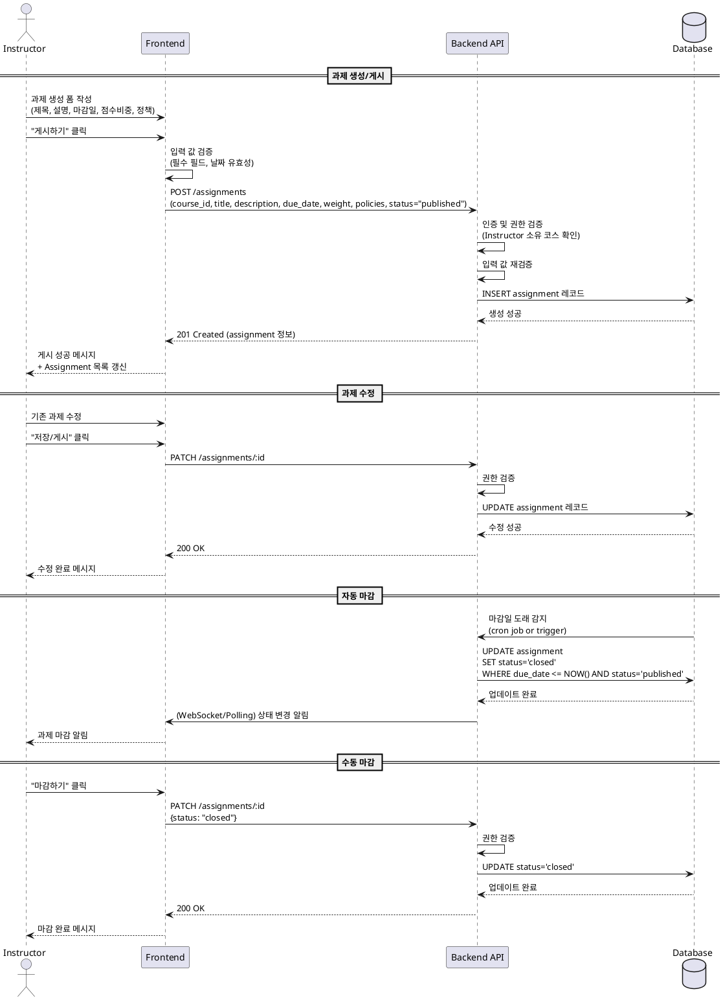

# Assignment 게시/마감 상세 유스케이스

## Primary Actor

Instructor

## Precondition

- 사용자가 Instructor 역할로 로그인되어 있음
- 본인이 소유한 코스가 존재함

## Trigger

- Instructor가 과제 생성/수정 후 "게시하기" 버튼 클릭
- 마감일이 도래하여 자동 마감 트리거
- Instructor가 "마감하기" 버튼 수동 클릭

## Main Scenario

### 과제 생성 및 게시

1. Instructor가 코스 상세 페이지에서 "과제 생성" 버튼 클릭
2. 과제 생성 폼에서 다음 정보 입력:
   - 제목 (필수)
   - 설명 (필수)
   - 마감일 (필수, 현재 시점 이후)
   - 점수 비중 (0~100, 필수)
   - 지각 허용 여부 (Boolean)
   - 재제출 허용 여부 (Boolean)
3. "게시하기" 버튼 클릭
4. 프론트엔드에서 입력 값 검증 (필수 필드, 날짜 유효성)
5. 백엔드 API 호출 (`POST /assignments`)
6. 백엔드에서 Instructor 권한 검증 (본인 소유 코스 확인)
7. 입력 값 재검증
8. Database에 Assignment 레코드 생성 (status: `published`)
9. Learner에게 과제 노출
10. 게시 성공 메시지 표시 및 Assignment 목록 갱신

### 과제 수정

1. Instructor가 기존 과제 선택 후 "수정" 버튼 클릭
2. 수정 폼에서 내용 변경
3. "저장" 또는 "게시" 버튼 클릭
4. 백엔드 API 호출 (`PATCH /assignments/:id`)
5. 권한 검증 및 입력 값 재검증
6. Database에서 Assignment 레코드 업데이트
7. 수정 완료 메시지 표시

### 자동 마감

1. 시스템이 주기적으로 마감일 도래 여부 확인 (Cron job or Database trigger)
2. 마감일이 현재 시간 이전이고 상태가 `published`인 과제 조회
3. 해당 과제 상태를 `closed`로 변경
4. Learner 화면에 마감 상태 반영

### 수동 마감

1. Instructor가 과제 상세 페이지에서 "마감하기" 버튼 클릭
2. 백엔드 API 호출 (`PATCH /assignments/:id`, status: `closed`)
3. 권한 검증
4. Database에서 Assignment 상태를 `closed`로 업데이트
5. 마감 완료 메시지 표시
6. Learner에게 제출 불가 상태 반영

## Edge Cases

- **필수 필드 누락**: 제목, 설명, 마감일 중 하나라도 비어있으면 게시 불가, 에러 메시지 표시
- **과거 마감일 설정**: 현재 시간보다 이전 날짜로 설정 시 게시 차단, "미래 날짜를 선택하세요" 메시지
- **비인가 코스 접근**: 다른 Instructor의 코스에 과제 생성 시도 시 403 Forbidden 응답
- **이미 마감된 과제 수정**: 마감(`closed`) 상태의 과제는 수정 불가, "마감된 과제는 수정할 수 없습니다" 메시지
- **점수 비중 초과**: 코스 내 모든 과제 점수 비중 합이 100% 초과 시 경고 메시지 (단, 차단은 하지 않음)
- **동시 수정 충돌**: 여러 사용자가 동시 수정 시 낙관적 잠금(optimistic locking) 적용 또는 최신 저장 우선

## Business Rules

1. Assignment는 `draft`, `published`, `closed` 3가지 상태를 가짐
2. `draft` 상태에서는 Learner에게 노출되지 않음
3. `published` 상태에서만 Learner가 열람 및 제출 가능
4. 마감일 이후 자동으로 `closed` 상태로 전환
5. `closed` 상태에서는 제출 불가, Instructor의 채점만 가능
6. Instructor는 본인 소유 코스의 과제만 생성/수정/마감 가능
7. 점수 비중은 0~100 범위 내 정수 (합산 제한 없음, 경고만 표시)
8. 지각 허용 및 재제출 허용은 Boolean 값
9. 마감일은 과제 생성 시점 이후여야 함
10. 과제 삭제는 제출물이 없을 때만 가능 (soft delete 권장)

## Sequence Diagram

