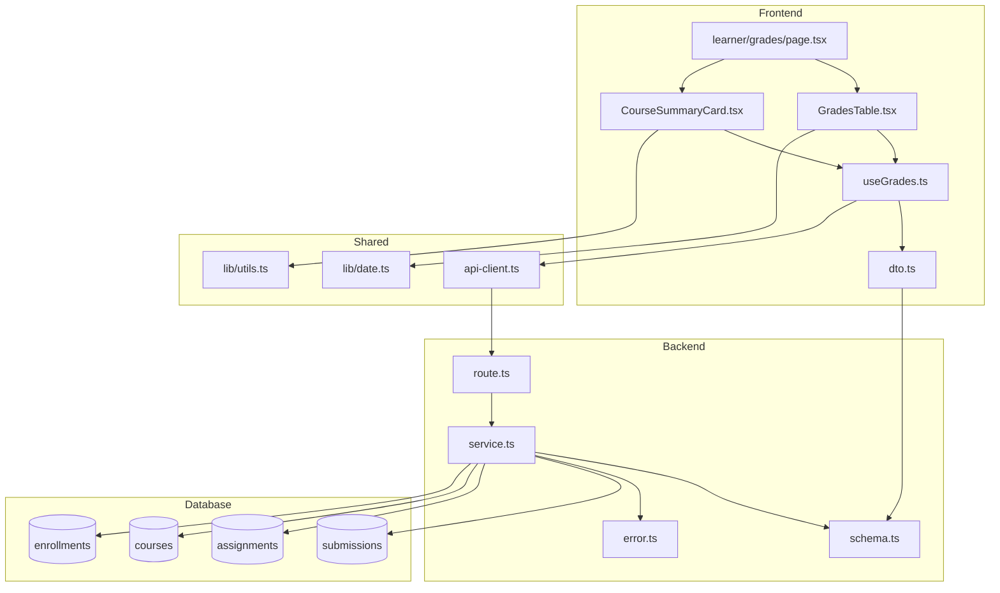

# Implementation Plan: 성적 & 피드백 열람 (Learner)

## 개요

### Backend Modules

| 모듈 | 위치 | 설명 |
|------|------|------|
| Grades Schema | `src/features/grades/backend/schema.ts` | 성적 조회 요청/응답 스키마 정의 |
| Grades Service | `src/features/grades/backend/service.ts` | 학습자 성적 조회 및 총점 계산 비즈니스 로직 |
| Grades Route | `src/features/grades/backend/route.ts` | Hono 라우터 - `/api/grades` 엔드포인트 |
| Grades Error | `src/features/grades/backend/error.ts` | 성적 관련 에러 코드 정의 |

### Frontend Modules

| 모듈 | 위치 | 설명 |
|------|------|------|
| DTO Export | `src/features/grades/lib/dto.ts` | Backend schema 재노출 (타입 공유) |
| Grades Hook | `src/features/grades/hooks/useGrades.ts` | React Query 훅 - 성적 데이터 fetching |
| Grades Table | `src/features/grades/components/GradesTable.tsx` | 성적 목록 테이블 컴포넌트 |
| Course Summary Card | `src/features/grades/components/CourseSummaryCard.tsx` | 코스별 총점 요약 카드 |
| Grades Page | `src/app/(authenticated)/learner/grades/page.tsx` | 학습자 성적 페이지 |

### Shared/Reusable Modules

- **Status Badge**: 제출 상태 표시 배지 컴포넌트 (기존 `submissions` 기능에서 재사용 가능)
- **Score Display**: 점수 포맷팅 유틸리티 (신규 또는 기존 `lib/utils.ts` 확장)
- **Date Formatter**: `src/lib/date.ts` 활용

---

## Diagram



---

## Implementation Plan

### 1. Backend Layer

#### 1.1. `src/features/grades/backend/schema.ts`

**목적**: 성적 조회 관련 Zod 스키마 정의

**주요 스키마**:
- `GradeItemSchema`: 개별 과제 성적 정보
  - `assignmentId`, `assignmentTitle`, `assignmentWeight`
  - `submissionId`, `status`, `score`, `feedback`
  - `isLate`, `submittedAt`, `gradedAt`
- `CourseSummarySchema`: 코스별 총점 정보
  - `courseId`, `courseTitle`
  - `totalScore` (가중 평균)
  - `gradedCount`, `totalCount`
- `GradesResponseSchema`: 전체 성적 응답
  - `grades: GradeItem[]`
  - `courseSummaries: CourseSummary[]`

**Export**:
```typescript
export type GradeItem = z.infer<typeof GradeItemSchema>;
export type CourseSummary = z.infer<typeof CourseSummarySchema>;
export type GradesResponse = z.infer<typeof GradesResponseSchema>;
```

#### 1.2. `src/features/grades/backend/error.ts`

**에러 코드**:
```typescript
export const gradesErrorCodes = {
  unauthorized: 'UNAUTHORIZED',
  forbidden: 'FORBIDDEN',
  noEnrollments: 'NO_ENROLLMENTS',
  databaseError: 'DATABASE_ERROR',
} as const;
```

#### 1.3. `src/features/grades/backend/service.ts`

**함수**: `getLearnerGrades(client: SupabaseClient, learnerId: string)`

**로직**:
1. learner 프로필 검증 (role='learner')
2. enrollments 조회 (learner가 등록한 코스 목록)
3. 각 코스별로:
   - assignments 조회 (해당 코스의 과제 목록)
   - submissions 조회 (learner의 제출물)
   - JOIN하여 성적 데이터 구성
4. 코스별 총점 계산:
   - `totalScore = Σ(score × weight) / Σ(weight)` (가중 평균)
   - 채점된 과제만 계산에 포함
5. `GradesResponse` 형식으로 반환

**Unit Tests**:
- ✅ learner 권한 검증 실패 시 401 반환
- ✅ 등록된 코스가 없을 때 빈 배열 반환
- ✅ 채점된 과제가 있을 때 올바른 총점 계산
- ✅ 미채점 과제는 총점 계산에서 제외
- ✅ 여러 코스의 성적을 올바르게 분리하여 반환
- ✅ 지각 제출 플래그 올바르게 반영
- ✅ 재제출 요청 상태 올바르게 반영

#### 1.4. `src/features/grades/backend/route.ts`

**엔드포인트**: `GET /api/grades`

**로직**:
1. `x-user-id` 헤더 검증
2. `getLearnerGrades` 서비스 호출
3. `respond` 헬퍼로 응답 반환

**Error Handling**:
- 401: 인증 실패
- 403: Learner 권한 아님
- 500: DB 오류

---

### 2. Frontend Layer

#### 2.1. `src/features/grades/lib/dto.ts`

**목적**: Backend 스키마 재노출

```typescript
export {
  GradeItemSchema,
  CourseSummarySchema,
  GradesResponseSchema,
  type GradeItem,
  type CourseSummary,
  type GradesResponse,
} from '@/features/grades/backend/schema';
```

#### 2.2. `src/features/grades/hooks/useGrades.ts`

**목적**: React Query 훅 - 성적 데이터 fetching

**로직**:
1. `getSupabaseBrowserClient()`로 세션 가져오기
2. `apiClient.get('/api/grades', { headers: { 'x-user-id': userId } })`
3. 응답 검증 (`GradesResponseSchema.parse()`)
4. 에러 처리 및 반환

**Query Key**: `['grades', learnerId]`

**QA Sheet**:
- ✅ 로그인하지 않은 사용자 접근 시 에러 처리
- ✅ 성적 데이터가 없을 때 빈 상태 UI 표시
- ✅ 성적 데이터 로딩 중 스켈레톤 표시
- ✅ API 에러 발생 시 에러 메시지 표시
- ✅ 성적 데이터 성공적으로 로드 시 테이블/카드 렌더링

#### 2.3. `src/features/grades/components/GradesTable.tsx`

**Props**: `{ grades: GradeItem[] }`

**UI 구성**:
- Table 컬럼:
  - 과제명 (Assignment Title)
  - 제출 상태 (Status Badge)
  - 점수 (Score/100)
  - 지각 여부 (Late Flag)
  - 피드백 (Feedback - tooltip or expand)
  - 제출일 (Submitted At)
  - 채점일 (Graded At)
- 정렬: 제출일 기준 내림차순
- 필터: 코스별 필터링 (optional)

**QA Sheet**:
- ✅ 채점된 과제는 점수 표시
- ✅ 미채점 과제는 "채점 대기 중" 표시
- ✅ 재제출 요청된 과제는 "재제출 요청됨" 배지 표시
- ✅ 지각 제출은 "지각" 배지 표시
- ✅ 피드백이 없을 때 "피드백 없음" 표시
- ✅ 피드백이 긴 경우 tooltip 또는 expand 버튼
- ✅ 날짜는 한국어 포맷 (`yyyy년 MM월 dd일 HH:mm`)

#### 2.4. `src/features/grades/components/CourseSummaryCard.tsx`

**Props**: `{ summary: CourseSummary }`

**UI 구성**:
- 코스 제목
- 총점 표시 (대형 폰트, 강조)
- 채점 완료 과제 수 / 전체 과제 수
- Progress bar (채점 완료율)

**QA Sheet**:
- ✅ 총점이 소수점일 경우 반올림 표시 (예: 85.5점)
- ✅ 채점되지 않은 과제가 있을 때 진행률 표시
- ✅ 모든 과제가 채점되면 100% 표시

#### 2.5. `src/app/(authenticated)/learner/grades/page.tsx`

**목적**: 학습자 성적 페이지

**로직**:
1. `useGrades()` 훅 호출
2. Loading/Error 상태 처리
3. `CourseSummaryCard` 그리드 렌더링
4. `GradesTable` 렌더링

**Layout**:
```tsx
'use client';

export default async function GradesPage() {
  const { data, isLoading, error } = useGrades();

  if (isLoading) return <Skeleton />;
  if (error) return <ErrorMessage />;
  if (!data || data.grades.length === 0) return <EmptyState />;

  return (
    <div>
      <h1>내 성적</h1>
      <div className="grid grid-cols-1 md:grid-cols-2 gap-4">
        {data.courseSummaries.map(summary => (
          <CourseSummaryCard key={summary.courseId} summary={summary} />
        ))}
      </div>
      <GradesTable grades={data.grades} />
    </div>
  );
}
```

**QA Sheet**:
- ✅ 페이지 첫 진입 시 성적 데이터 자동 로드
- ✅ 등록된 코스가 없을 때 "등록된 코스가 없습니다" 메시지
- ✅ 제출한 과제가 없을 때 "제출한 과제가 없습니다" 메시지
- ✅ 모바일에서 반응형 레이아웃 (카드 1열, 테이블 스크롤)
- ✅ 페이지 새로고침 시 최신 성적 데이터 반영

---

### 3. Integration & Testing

#### 3.1. Backend Integration

1. `src/backend/hono/app.ts`에 라우터 등록:
   ```typescript
   import { registerGradesRoutes } from '@/features/grades/backend/route';

   // ...
   registerGradesRoutes(app);
   ```

2. Unit Test 실행:
   - Service 로직 테스트 (총점 계산 검증)
   - 권한 검증 테스트
   - Edge case 테스트

#### 3.2. Frontend Integration

1. 네비게이션 메뉴에 "내 성적" 링크 추가
2. QA 시트 기반 UI 테스트
3. E2E 시나리오:
   - 로그인 → 성적 페이지 접근 → 데이터 로드 확인
   - 채점된 과제 클릭 → 피드백 확인
   - 코스별 총점 계산 검증

---

### 4. Database Considerations

기존 테이블 활용:
- `submissions`: 제출물, 점수, 피드백, 상태
- `assignments`: 과제 정보, 비중 (weight)
- `courses`: 코스 정보
- `enrollments`: 학습자 등록 정보

**추가 인덱스 불필요** (기존 인덱스로 충분):
- `idx_submissions_learner` (learner_id)
- `idx_enrollments_learner` (learner_id)
- `idx_assignments_course` (course_id)

---

### 5. Validation & Error Handling

#### Backend
- ✅ learner 권한 검증 (role='learner')
- ✅ 본인 데이터만 조회 (learner_id 일치)
- ✅ DB 조회 실패 시 500 에러
- ✅ 빈 결과는 빈 배열 반환 (에러 아님)

#### Frontend
- ✅ 401/403 에러 시 로그인 페이지로 리다이렉트
- ✅ 500 에러 시 "서버 오류" 메시지 + 재시도 버튼
- ✅ 네트워크 에러 시 "네트워크 연결 확인" 메시지

---

### 6. Performance Optimization

- **DB 쿼리 최적화**:
  - `enrollments` → `courses` → `assignments` → `submissions` JOIN
  - 1회 쿼리로 모든 데이터 조회 (N+1 문제 방지)
- **Frontend 캐싱**:
  - React Query staleTime: 5분
  - 페이지 이동 후 복귀 시 캐시 활용
- **Lazy Loading**:
  - 과제가 많을 경우 pagination 고려 (향후 확장)

---

### 7. Future Enhancements

- 📊 성적 그래프 (Chart.js 또는 Recharts)
- 📄 PDF 내보내기 (성적표 다운로드)
- 🔔 채점 완료 알림 (푸시 또는 이메일)
- 📈 코스별 성적 통계 (평균, 최고/최저점)
