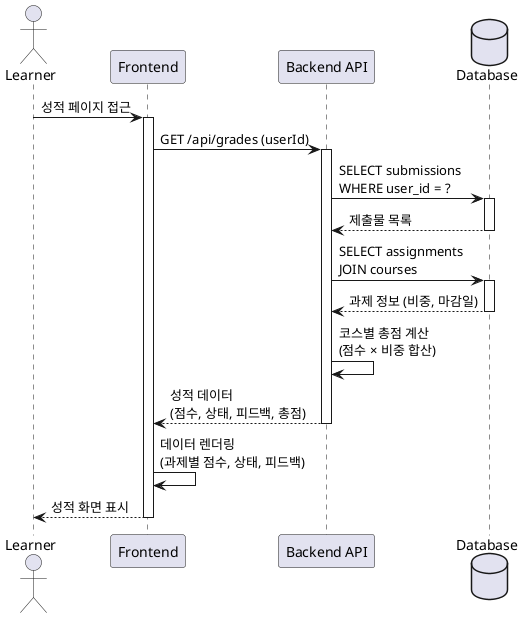

# Use Case: 성적 & 피드백 열람 (Learner)

## Primary Actor
Learner (학습자)

## Precondition
- 학습자가 로그인되어 있어야 함
- 최소 하나 이상의 코스에 등록되어 있어야 함
- 해당 코스에 제출한 과제가 존재해야 함

## Trigger
학습자가 성적 페이지에 접근

## Main Scenario

1. 학습자가 성적 페이지 메뉴를 클릭
2. FE가 학습자의 제출물 목록 조회 요청
3. BE가 학습자 본인의 제출물만 필터링하여 조회
4. Database에서 제출물, 점수, 피드백, 과제 정보 조회
5. BE가 코스별 총점 계산 (각 과제 점수 × 비중 합산)
6. FE가 다음 정보를 표시:
   - 과제별 점수
   - 제출 상태 (제출됨/지각/graded/재제출요청)
   - 지각 여부 플래그
   - 재제출 요청 여부
   - 강사 피드백
   - 코스별 총점 요약

## Edge Cases

### 1. 채점되지 않은 과제
- 제출은 완료했으나 강사가 아직 채점하지 않은 경우
- "채점 대기 중" 상태로 표시

### 2. 재제출 요청된 과제
- 강사가 재제출 요청한 경우
- 상태를 "재제출 요청됨"으로 표시하고 피드백 강조

### 3. 미제출 과제
- 등록된 코스의 과제를 제출하지 않은 경우
- "미제출" 상태로 표시, 점수는 0점 또는 null

### 4. 권한 없는 접근
- 타 학습자의 성적 조회 시도
- 403 Forbidden 응답, 접근 차단 메시지 표시

### 5. 데이터 조회 실패
- DB 연결 오류 또는 timeout
- 오류 메시지 표시 및 재시도 옵션 제공

## Business Rules

### BR-1: 본인 데이터만 조회
- 학습자는 본인이 제출한 과제의 성적과 피드백만 열람 가능
- 타 학습자의 성적은 조회 불가

### BR-2: 코스 총점 계산
- 총점 = Σ(과제 점수 × 과제 비중)
- 비중의 합은 100%를 초과할 수 있음 (추가 점수 정책)
- 미채점 과제는 총점 계산에서 제외하거나 0점 처리

### BR-3: 상태별 표시
- `submitted`: 제출 완료, 채점 대기
- `graded`: 채점 완료
- `resubmission_required`: 재제출 요청됨
- `late=true`: 지각 제출 플래그 표시

### BR-4: 피드백 표시
- 강사가 입력한 피드백은 채점 완료 후 즉시 공개
- 피드백이 없는 경우 "피드백 없음" 표시

### BR-5: 실시간 반영
- 강사의 채점/피드백 입력 즉시 학습자 화면에 반영
- 페이지 새로고침 또는 자동 갱신으로 최신 상태 유지

## Sequence Diagram

