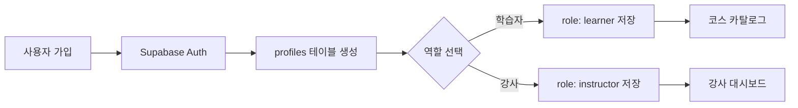
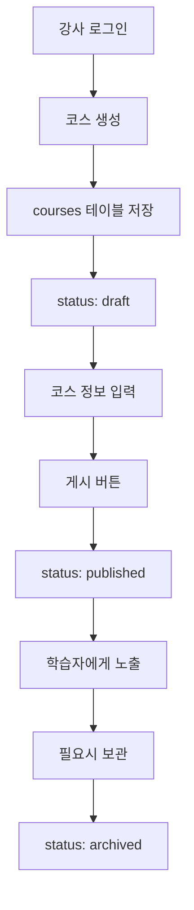
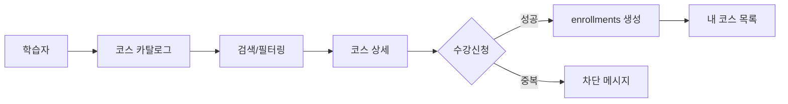
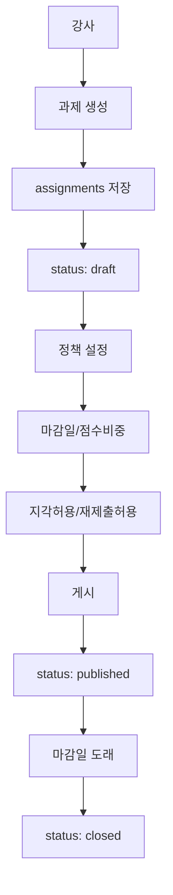
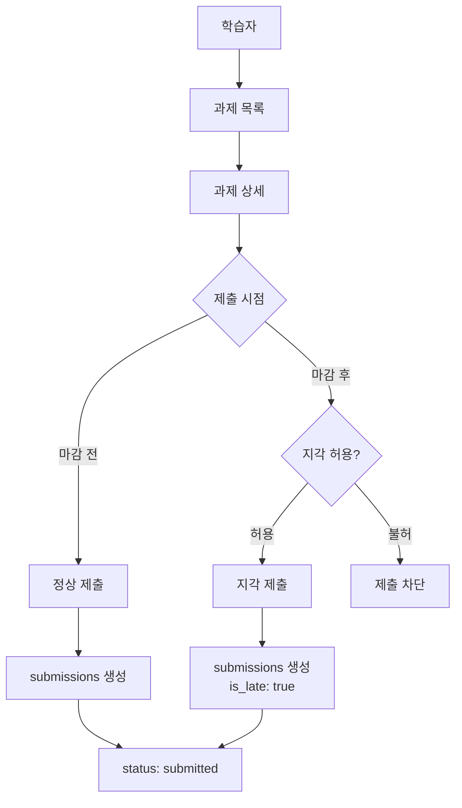
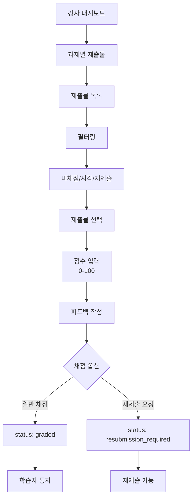
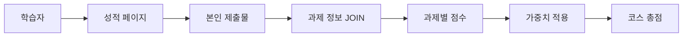
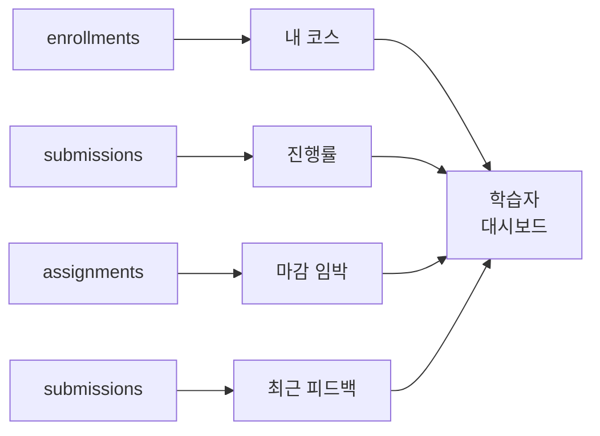
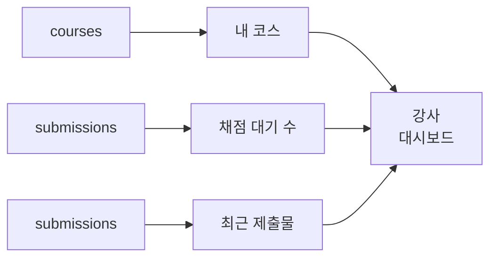

# 데이터베이스 설계 문서

## 개요

LMS(Learning Management System) 플랫폼의 데이터베이스 설계 문서입니다. PostgreSQL(Supabase)을 기반으로 설계되었으며, 강사가 코스를 개설·운영하고 학습자가 수강·과제 제출·피드백을 받을 수 있는 경량 LMS의 핵심 데이터 구조를 정의합니다.

## 데이터 플로우

### 1. 사용자 인증 플로우


**상세 프로세스:**
- 사용자가 이메일/비밀번호로 가입하면 Supabase Auth를 통해 인증 정보 생성
- `profiles` 테이블에 기본 사용자 정보 저장 (이름, 휴대폰번호, 역할, 약관동의시간)
- 역할(learner/instructor)에 따라 접근 가능한 기능 분기
- Learner → 코스 카탈로그 첫 진입
- Instructor → 대시보드 첫 진입

### 2. 코스 관리 플로우


**상세 프로세스:**
- 강사가 코스 생성 → `courses` 레코드 생성 (status: draft)
- 코스 정보 입력 (제목, 설명, 카테고리, 난이도) → `courses` 업데이트
- 게시 버튼 클릭 → `courses` 상태 변경 (draft → published)
- published 상태의 코스만 학습자 카탈로그에 노출
- 필요시 보관 처리 → `courses` 상태 변경 (published → archived)

### 3. 수강신청 플로우


**상세 프로세스:**
- 학습자가 코스 카탈로그에서 검색어, 필터(카테고리, 난이도), 정렬(최신순/인기순) 적용
- published 상태 코스만 조회 가능
- 코스 상세 페이지에서 수강신청 버튼 클릭
- 중복 신청 여부 확인 → `enrollments` 테이블 UNIQUE 제약 검증
- 신청 가능 시 → `enrollments` 레코드 생성 (course_id, learner_id)
- 학습자 대시보드 "내 코스" 목록에 반영

### 4. 과제 생성 및 게시 플로우


**상세 프로세스:**
- 강사가 특정 코스에 과제 생성 → `assignments` 레코드 생성 (status: draft)
- 과제 정책 설정:
  - title, description (제목, 설명)
  - due_date (마감일)
  - weight (점수 비중)
  - allow_late (지각 허용 여부)
  - allow_resubmission (재제출 허용 여부)
- 게시 버튼 클릭 → `assignments` 상태 변경 (draft → published)
- published 상태만 학습자에게 노출
- 마감일 도래 시 → `assignments` 상태 변경 (published → closed)

### 5. 과제 제출 플로우


**상세 프로세스:**
- 학습자가 등록한 코스의 과제 목록 조회
- 과제 상세에서 content(텍스트, 필수), link(URL, 선택) 입력
- 제출 시점 검증:
  - 현재 시간 < due_date → 정상 제출 (is_late: false)
  - 현재 시간 > due_date & allow_late: true → 지각 제출 (is_late: true)
  - 현재 시간 > due_date & allow_late: false → 제출 차단
- 재제출 검증:
  - allow_resubmission: true → 기존 레코드 UPDATE 또는 새 버전 생성
  - allow_resubmission: false → 최초 제출 1회만 허용
- `submissions` 레코드 생성/업데이트 (status: submitted)

### 6. 채점 및 피드백 플로우


**상세 프로세스:**
- 강사가 본인 소유 코스의 과제 제출물 조회
- 필터: 미채점(submitted), 지각(is_late=true), 재제출요청(resubmission_required)
- 점수(0-100) 및 피드백(필수) 입력
- 채점 완료 시:
  - 일반 채점 → `submissions` UPDATE (status: graded, score, feedback, graded_at)
  - 재제출 요청 → `submissions` UPDATE (status: resubmission_required, feedback)
- 학습자는 성적/피드백 페이지에서 결과 확인

### 7. 성적 조회 플로우


**상세 프로세스:**
- 학습자가 특정 코스의 성적 페이지 접근
- 본인 제출물만 조회 가능 (WHERE learner_id = current_user)
- `submissions`와 `assignments` JOIN으로 과제 정보 획득
- 과제별 표시 정보:
  - 점수 (score)
  - 지각 여부 (is_late)
  - 상태 (submitted/graded/resubmission_required)
  - 피드백 (feedback)
- 코스 총점 계산: SUM(score × weight / 100)

### 8. 대시보드 데이터 집계 플로우

#### 학습자 대시보드


**집계 데이터:**
- 내 코스: `enrollments` WHERE learner_id = current_user
- 진행률: COUNT(graded) / COUNT(total assignments) per course
- 마감 임박 과제: `assignments` WHERE due_date 임박 & status='published'
- 최근 피드백: `submissions` WHERE status='graded' ORDER BY graded_at DESC

#### 강사 대시보드


**집계 데이터:**
- 내 코스: `courses` WHERE instructor_id = current_user
- 채점 대기 수: COUNT(`submissions` WHERE status='submitted')
- 최근 제출물: `submissions` ORDER BY submitted_at DESC

## 데이터베이스 스키마

### 테이블 구조

#### 1. profiles (사용자 기본 정보)
| 컬럼명 | 타입 | 제약조건 | 설명 |
|--------|------|----------|------|
| id | UUID | PK, FK(auth.users) | 사용자 고유 ID |
| role | TEXT | NOT NULL, CHECK | 역할 (learner/instructor) |
| name | TEXT | NOT NULL | 사용자 이름 |
| phone_number | TEXT | NOT NULL | 휴대폰번호 |
| terms_agreed_at | TIMESTAMPTZ | NOT NULL | 약관 동의 시간 |
| created_at | TIMESTAMPTZ | DEFAULT NOW() | 생성 시간 |
| updated_at | TIMESTAMPTZ | DEFAULT NOW() | 수정 시간 |

#### 2. courses (코스)
| 컬럼명 | 타입 | 제약조건 | 설명 |
|--------|------|----------|------|
| id | UUID | PK | 코스 고유 ID |
| instructor_id | UUID | FK(profiles), NOT NULL | 강사 ID |
| title | TEXT | NOT NULL | 코스 제목 |
| description | TEXT | | 코스 설명 |
| category | TEXT | | 카테고리 |
| difficulty | TEXT | CHECK | 난이도 (beginner/intermediate/advanced) |
| status | TEXT | DEFAULT 'draft', CHECK | 상태 (draft/published/archived) |
| created_at | TIMESTAMPTZ | DEFAULT NOW() | 생성 시간 |
| updated_at | TIMESTAMPTZ | DEFAULT NOW() | 수정 시간 |

**인덱스:** instructor_id, status

#### 3. enrollments (수강신청)
| 컬럼명 | 타입 | 제약조건 | 설명 |
|--------|------|----------|------|
| id | UUID | PK | 수강신청 고유 ID |
| course_id | UUID | FK(courses), NOT NULL | 코스 ID |
| learner_id | UUID | FK(profiles), NOT NULL | 학습자 ID |
| enrolled_at | TIMESTAMPTZ | DEFAULT NOW() | 수강신청 시간 |
| created_at | TIMESTAMPTZ | DEFAULT NOW() | 생성 시간 |
| updated_at | TIMESTAMPTZ | DEFAULT NOW() | 수정 시간 |

**제약조건:** UNIQUE(course_id, learner_id) - 중복 수강신청 방지
**인덱스:** course_id, learner_id

#### 4. assignments (과제)
| 컬럼명 | 타입 | 제약조건 | 설명 |
|--------|------|----------|------|
| id | UUID | PK | 과제 고유 ID |
| course_id | UUID | FK(courses), NOT NULL | 코스 ID |
| title | TEXT | NOT NULL | 과제 제목 |
| description | TEXT | NOT NULL | 과제 설명 |
| due_date | TIMESTAMPTZ | NOT NULL | 마감일 |
| weight | DECIMAL(5,2) | NOT NULL, CHECK(0-100) | 점수 비중 |
| allow_late | BOOLEAN | DEFAULT FALSE | 지각 제출 허용 여부 |
| allow_resubmission | BOOLEAN | DEFAULT FALSE | 재제출 허용 여부 |
| status | TEXT | DEFAULT 'draft', CHECK | 상태 (draft/published/closed) |
| created_at | TIMESTAMPTZ | DEFAULT NOW() | 생성 시간 |
| updated_at | TIMESTAMPTZ | DEFAULT NOW() | 수정 시간 |

**인덱스:** course_id, status, due_date

#### 5. submissions (제출물)
| 컬럼명 | 타입 | 제약조건 | 설명 |
|--------|------|----------|------|
| id | UUID | PK | 제출물 고유 ID |
| assignment_id | UUID | FK(assignments), NOT NULL | 과제 ID |
| learner_id | UUID | FK(profiles), NOT NULL | 학습자 ID |
| content | TEXT | NOT NULL | 제출 내용 (텍스트) |
| link | TEXT | | 제출 링크 (URL) |
| is_late | BOOLEAN | DEFAULT FALSE | 지각 제출 여부 |
| status | TEXT | DEFAULT 'submitted', CHECK | 상태 (submitted/graded/resubmission_required) |
| score | DECIMAL(5,2) | CHECK(0-100) | 점수 |
| feedback | TEXT | | 피드백 |
| submitted_at | TIMESTAMPTZ | DEFAULT NOW() | 제출 시간 |
| graded_at | TIMESTAMPTZ | | 채점 시간 |
| created_at | TIMESTAMPTZ | DEFAULT NOW() | 생성 시간 |
| updated_at | TIMESTAMPTZ | DEFAULT NOW() | 수정 시간 |

**제약조건:** UNIQUE(assignment_id, learner_id) - 재제출 불가 시 중복 방지
**인덱스:** assignment_id, learner_id, status

### 인덱스 설계

성능 최적화를 위한 인덱스:

```sql
-- 사용자 역할별 조회
CREATE INDEX idx_profiles_role ON profiles(role);

-- 코스 조회 최적화
CREATE INDEX idx_courses_instructor ON courses(instructor_id);
CREATE INDEX idx_courses_status ON courses(status);

-- 수강신청 조회 최적화
CREATE INDEX idx_enrollments_learner ON enrollments(learner_id);
CREATE INDEX idx_enrollments_course ON enrollments(course_id);

-- 과제 조회 최적화
CREATE INDEX idx_assignments_course ON assignments(course_id);
CREATE INDEX idx_assignments_status ON assignments(status);
CREATE INDEX idx_assignments_due_date ON assignments(due_date);

-- 제출물 조회 최적화
CREATE INDEX idx_submissions_assignment ON submissions(assignment_id);
CREATE INDEX idx_submissions_learner ON submissions(learner_id);
CREATE INDEX idx_submissions_status ON submissions(status);
```

### 트리거

모든 테이블의 `updated_at` 컬럼 자동 업데이트를 위한 트리거:

```sql
CREATE OR REPLACE FUNCTION update_updated_at_column()
RETURNS TRIGGER AS $$
BEGIN
    NEW.updated_at = NOW();
    RETURN NEW;
END;
$$ LANGUAGE plpgsql;
```

각 테이블마다 트리거 적용:
- update_profiles_updated_at
- update_courses_updated_at
- update_enrollments_updated_at
- update_assignments_updated_at
- update_submissions_updated_at

### Row Level Security (RLS)

프로젝트 요구사항에 따라 모든 테이블의 RLS는 **비활성화** 상태입니다.

## 데이터 무결성 규칙

### 외래 키 제약
- `profiles.id` → `auth.users.id` (CASCADE DELETE)
- `courses.instructor_id` → `profiles.id` (CASCADE DELETE)
- `enrollments.course_id` → `courses.id` (CASCADE DELETE)
- `enrollments.learner_id` → `profiles.id` (CASCADE DELETE)
- `assignments.course_id` → `courses.id` (CASCADE DELETE)
- `submissions.assignment_id` → `assignments.id` (CASCADE DELETE)
- `submissions.learner_id` → `profiles.id` (CASCADE DELETE)

### 유니크 제약
- `(course_id, learner_id)` in enrollments - 중복 수강신청 방지
- `(assignment_id, learner_id)` in submissions - 재제출 불가 시 중복 제출 방지

### CHECK 제약
- `profiles.role` IN ('learner', 'instructor')
- `courses.status` IN ('draft', 'published', 'archived')
- `courses.difficulty` IN ('beginner', 'intermediate', 'advanced')
- `assignments.status` IN ('draft', 'published', 'closed')
- `assignments.weight` BETWEEN 0 AND 100
- `submissions.status` IN ('submitted', 'graded', 'resubmission_required')
- `submissions.score` BETWEEN 0 AND 100

## 확장 가능성

향후 추가될 수 있는 기능:
1. **공지사항 시스템**: 코스별 공지사항 관리
2. **토론 게시판**: 코스별 Q&A 및 토론
3. **평가 시스템**: 코스 평점 및 리뷰
4. **출석 관리**: 온라인 세션 참여 기록
5. **알림 시스템**: 마감일 알림, 채점 완료 알림 등

이러한 기능들은 현재 스키마를 기반으로 별도 테이블을 추가하여 구현 가능합니다.